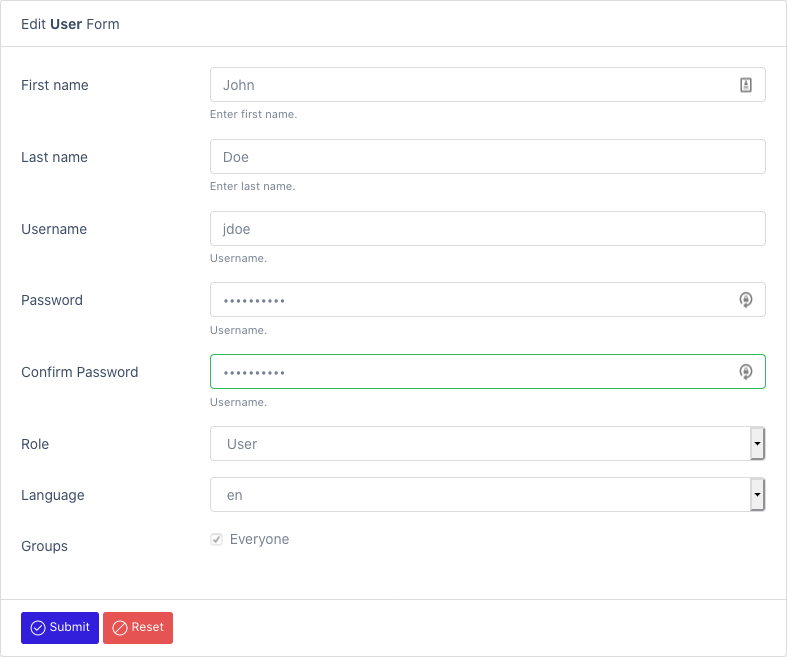

# User Authentication

## Internal (Database)

Out of the box, only one user is created during installation. It is the admin account.
This account is always persisted in the database no matter what.

You can also create internal users when needed.

See [Create User](/datamaker/users/create)




## External

When an external authentication mechanism is used, the users are automatically synced when they first connect to the platform.

### Cognito (Amazon)

To use Cognito with Elastic bean stalk, you need to configure https first: https://docs.aws.amazon.com/elasticbeanstalk/latest/dg/configuring-https.html

Activate Cognito in your AWS tenant:
- https://www.baeldung.com/spring-security-oauth-cognito
- https://docs.aws.amazon.com/cognito/latest/developerguide/getting-started-with-cognito-user-pools.html

Activate the amazon profile:
- Modify the service.conf file (in /opt/datamaker)
```shell
JAVA_OPTS='-Xmx512M -Dspring.profiles.active=amazon,cognito -Dlogging.pattern.console= -Dlogging.file.path=/opt/datamaker/logs'
```

You can also use an environment variable:
export spring_profiles_active=cognito

Create application-amazon.properties inside ${application.config.path}/jar directory. 
Make sure to select the jar file type.
You can use the file manager to do that: [Create resource file](/datamaker/system/files/create)

Fill out the clientId, clientSecret, server, issuerUri (if needed)

```yaml
spring:
  security:
    oauth2:
      client:
        registration:
          cognito:
            clientId: ...
            clientSecret: ....
            scope: openid
            redirect-uri: http://{server}/datamaker/login/oauth2/code/cognito
            clientName: datamaker-client
        provider:
          cognito:
            issuerUri: https://cognito-idp.ca-central-1.amazonaws.com/ca-central-1_zlOxEgek0
            user-name-attribute: cognito:username
```

### Azure AD

Activate OAuth in your Azure tenant:
- https://docs.microsoft.com/en-ca/azure/active-directory/develop/quickstart-register-app
- https://docs.microsoft.com/en-us/azure/developer/java/spring-framework/configure-spring-boot-starter-java-app-with-azure-active-directory
- https://github.com/Azure/azure-sdk-for-java/tree/master/sdk/spring/azure-spring-boot-samples/azure-spring-boot-sample-active-directory-backend

Activate the azure profile:
- Modify the service.conf file (in /opt/datamaker)
```shell
JAVA_OPTS='-Xmx512M -Dspring.profiles.active=azure -Dlogging.pattern.console= -Dlogging.file.path=/opt/datamaker/logs'
```

You can also use an environment variable:
export spring_profiles_active=azure

Create application-azure.yml inside ${application.config.path}/jar directory.
Make sure to select the jar file type.
You can use the file manager to do that: [Create resource file](/datamaker/system/files/create)

Fill out the client-id, client-secret, server, tenant-id, allowed-groups, admin.roles, user.roles


```yaml
azure:
  activedirectory:
    tenant-id: 3-312-312-312-312
    client-id: 213-312-312-86a8-3212
    client-secret: 3212321231
    user-group:
      allowed-group-names: group1, group2
admn:
  roles: group1
user:
  roles: group2
```

### Ldap (generic)

Activate the ldap profile:
- Modify the service.conf file (in /opt/datamaker)
```shell
JAVA_OPTS='-Xmx512M -Dspring.profiles.active=ldap -Dlogging.pattern.console= -Dlogging.file.path=/opt/datamaker/logs'
```

You can also use an environment variable:
export spring_profiles_active=ldap

Create application-azure.properties inside ${application.config.path}/jar directory.
Make sure to select the jar file type.
You can use the file manager to do that: [Create resource file](/datamaker/system/files/create)

Fill out the userSearchFilter, url, domain, rootDn, OU


```properties
# LDAP AUTHENTICATION MANAGER
security.ldap.userSearchFilter=userPrincipalName={0}
security.ldap.url=ldap://azure.datamaker.ai:389/
security.ldap.domain=datamaker.ai
security.ldap.rootDn=DC=azure,DC=datamaker,DC=ai
OU=AADDC%20Users,DC=azure,DC=datamaker,DC=ai
```

### Active directory

Activate the ldap-ad profile:
- Modify the service.conf file (in /opt/datamaker)
```shell
JAVA_OPTS='-Xmx512M -Dspring.profiles.active=ldap-ad -Dlogging.pattern.console= -Dlogging.file.path=/opt/datamaker/logs'
```

You can also use an environment variable:
export spring_profiles_active=ldap

Create application-ldap-ad.properties inside ${application.config.path}/jar directory.
Make sure to select the jar file type.
You can use the file manager to do that: [Create resource file](/datamaker/system/files/create)

Fill out the required properties.

```properties
# AUTHORITIES
admin.roles=MANAGERS
user.roles=DEVELOPERS

# LDAP AUTHENTICATION MANAGER
security.ldap.userDnPatterns="uid={0},ou=people"
security.ldap.userSearchBase=
security.ldap.userSearchFilter=
security.ldap.groupSearchBase="ou=groups"
security.ldap.groupSearchFilter=(uniqueMember={0})
security.ldap.url=ldap://localhost:8389/dc=springframework,dc=org
security.ldap.passwordAttribute=userPassword
security.ldap.managerDn=
security.ldap.managerPassword=
```
    
## Google
See OAuth2
