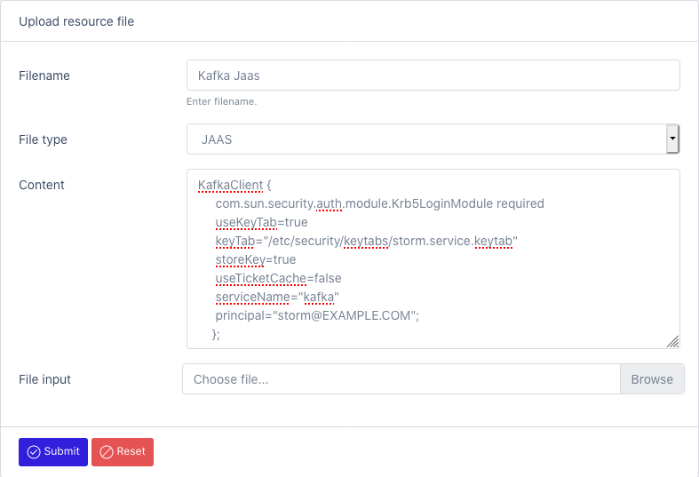

# Resource File Manager

The file manager can be used to manage all custom or external files required by the application to run jobs.
This includes databases drivers, sink libraries, security or encryption keys.

## Landing page
[File Manager](/datamaker/system/files)

# Edit page

[Create resource file](/datamaker/system/files/create)

File Type:
- JAR: use this type for uploading libraries (ex: JDBC, custom file format, sinks). These files will be added to the classpath.
  - You need to restart the service in order to use the uploaded artefact.
- KEYTAB: Kerberos principals and encrypted keys (ex: Hadoop, SOLR)
- JAAS: Java Authentication and Authorization Service (ex: Kafka)
- JKS: Java KeyStore
- RESOURCE: properties
- OTHER: any kind of file

You can copy paste the content of the file or upload it.

