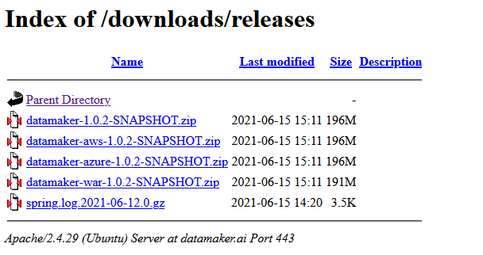
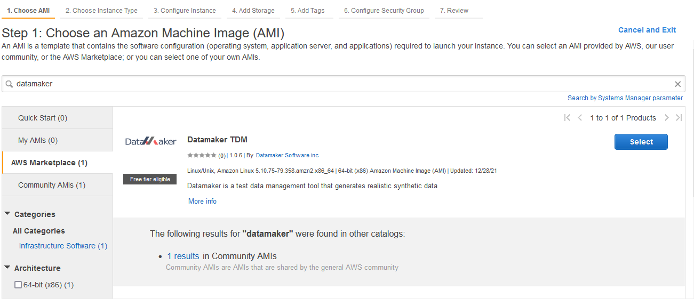

# Installation
{: .no_toc }

## Table of contents
{: .no_toc .text-delta }

1. TOC
{:toc}

## Requirements
- MySQL 8.0
  - You can use your own instance (Docker, Standalone, Cloud)
- Java 11
  - https://adoptopenjdk.net/releases.html


## Downloads

- Download the archive from here:
  https://www.datamaker.ai/downloads/releases
    - Use your company/user credentials (contact support if you didn't receive it yet)
    
- Use the latest version for your target architecture
  - default: self-contain service
  - azure: Application Service deployment
  - aws: Elastic Beanstalk deployment
  - gcp: Google Cloud Platform
  - war: Tomcat or J2EE container deployment
  - tar: Docker image

## Standalone (runnable jar)

- Download default version from downloads site: datamaker-${VERSION}.zip
- `cp datamaker-*.zip /opt`
- `cd /opt`
- `unzip datamaker-*.zip`
- `cd datamaker`
- Change or keep server port number:
````properties
server.port=8080
````
- Set MySQL database parameters in application.properties:
```properties
spring.datasource.url=jdbc:mysql://localhost:3306/datamaker
spring.datasource.driverClassName=com.mysql.cj.jdbc.Driver
spring.datasource.username=root
spring.datasource.password=changeme
```
- `./install.sh`
- Open up a browser and navigate to http://server_url:8080/datamaker
- Login using admin / changeme credentials

## Demo

- Download the archive from here:
  https://www.datamaker.ai/downloads/demo
- `cp datamaker-*.zip /opt`
- `cd /opt`
- `unzip datamaker-*.zip`
- `cd datamaker`
- Change or keep server port number:

  ```properties
  server.port=8080
  ```
- The demo version contains an embedded database. To activate, edit service.conf:
  ```text
  JAVA_OPTS='-Xmx512M -Dspring.active.profiles=demo -Dlogging.config=/opt/datamaker/logback-spring.xml -DLOGS_PATH=/opt/datamaker/logs'
  ```
- if you want to install as a service: `./install.sh`
- if you want to run it on demand: java -jar -Dspring.profiles.active=demo datamaker-${VERSION}.jar
- Open up a browser and navigate to http://server_url:8080/datamaker
- Login using admin / changeme credentials
  
## Docker 

- Download the docker image from here:
  https://www.datamaker.ai/downloads/releases
- replace ${VERSION} by version downloaded
- `docker images`
- `docker load < datamaker-docker-${VERSION}.tar`
- Change the running port number and the database connection
  ```
  docker run -p 8080:8080 \
  -e SPRING_DATASOURCE_URL=jdbc:mysql://${HOSTNAME}:3306/datamaker \
  -e SPRING_DATASOURCE_USERNAME=root \
  -e SPRING_DATASOURCE_PASSWORD=changeme \
  --name datamaker datamaker:${VERSION}
  ```
- Open up a browser and navigate to http://server_url:8080/datamaker
- Login using admin / changeme credentials


### Docker Compose

If you want to use a docker image of MySQL as well, use this setup.

- mkdir datamaker
- create docker-compose.yml
  - replace ${VERSION} by version downloaded
    
**docker-compose.yml template**

```yaml
version: '3.3'

services:

  db:
    image: mysql:8
    volumes:
       - db_data:/var/lib/mysql
#       - ./init.sql:/docker-entrypoint-initdb.d/init.sql
    command: --default-authentication-plugin=mysql_native_password
    restart: always
    ports:
      - 3306:3306
    environment:
      MYSQL_ROOT_PASSWORD: changeme
      MYSQL_DATABASE: datamaker

  service:
    image: datamaker:${VERSION}
    #restart: always
    depends_on:
      - db    
    ports:
      - 8080:8080

  adminer:
    image: adminer
    restart: always
    ports:
      - 8088:8080

volumes:
    db_data: {}
```
- docker compose up
- Open up a browser and navigate to http://server_url:8080/datamaker
- Login using admin / changeme credentials

To delete
- docker compose down

## AWS EC2

[See standalone section](install#standalone-runnable-jar)

## AWS Elactic Beanstalk

- Install AWS cli: https://aws.amazon.com/cli/
- Download Amazon version from downloads site: datamaker-aws-${VERSION}.zip
- Configure: `aws configure`
- Upload artefacts to S3 bucket
`aws s3 mb s3://elasticbeanstalk-datamaker`
`aws s3 cp datamaker-aws-1.0.5-SNAPSHOT.zip s3://elasticbeanstalk-datamaker`

- Create instance profile
`aws iam create-instance-profile --instance-profile-name aws-datamaker-ec2-role`
```
{
    "InstanceProfile": {
        "Path": "/",
        "InstanceProfileName": "aws-datamaker-ec2-role",
        "InstanceProfileId": "AIPA557JKSZV2JRYHDS5D",
        "Arn": "arn:aws:iam::957730166379:instance-profile/aws-datamaker-ec2-role",
        "CreateDate": "2021-10-13T18:07:05+00:00",
        "Roles": []
    }
}
```
- Copy the Arn value and paste in the next section under IamInstanceProfile option

- Create config file: options.json
```json
[
  {
    "Namespace": "aws:autoscaling:launchconfiguration",
    "OptionName": "IamInstanceProfile",
    "Value": "arn:aws:iam::957730166379:instance-profile/aws-elasticbeanstalk-ec2-role"
  },
  {
    "Namespace": "aws:elasticbeanstalk:application:environment",
    "OptionName": "LOADER_PATH",
    "Value": "/home/webapp/conf/jar"
  },
  {
    "Namespace": "aws:autoscaling:launchconfiguration",
    "OptionName": "InstanceType",
    "Value": "t2.large"
  },
  {
    "Namespace": "aws:elasticbeanstalk:application:environment",
    "OptionName": "SPRING_PROFILES_ACTIVE",
    "Value": "amazon"
  },
  {
    "Namespace": "aws:elasticbeanstalk:application:environment",
    "OptionName": "LOGS_PATH",
    "Value": "/home/webapp/datamaker/logs"
  },  
  {
    "Namespace": "aws:rds:dbinstance",
    "OptionName": "DBAllocatedStorage",
    "Value": "5"
  },
  {
    "Namespace": "aws:rds:dbinstance",
    "OptionName": "HasCoupledDatabase",
    "Value": "true"
  },
  {
    "Namespace": "aws:rds:dbinstance",
    "OptionName": "DBUser",
    "Value": "root"
  },
  {
    "Namespace": "aws:rds:dbinstance",
    "OptionName": "DBPassword",
    "Value": "changeme"
  },
  {
    "Namespace": "aws:rds:dbinstance",
    "OptionName": "DBDeletionPolicy",
    "Value": "Snapshot"
  },
  {
    "Namespace": "aws:rds:dbinstance",
    "OptionName": "DBName",
    "Value": "datamaker"
  }
]
```
- Create an elastic beanstalk 
`aws elasticbeanstalk create-application --application-name datamaker --description "Datamaker Testing Suite"`

- Create application version
`aws elasticbeanstalk create-application-version --application-name datamaker --version-label v1.0.5 --description datamaker-v1.0.5 --source-bundle S3Bucket="elasticbeanstalk-datamaker",S3Key="datamaker-aws-1.0.5-SNAPSHOT.zip" --auto-create-application`

- Create an environment
`aws elasticbeanstalk create-environment --application-name datamaker --environment-name datamaker-prod --version-label v1.0.5  --solution-stack-name "64bit Amazon Linux 2 v3.2.6 running Corretto 11" --option-settings --option-settings file://options.json`

- To enable authentication: see [Cognito](auth#cognito-amazon)


## Azure
- Install Azure cli: https://docs.microsoft.com/en-us/cli/azure/install-azure-cli
- Download Azure version from downloads site: datamaker-azure-${VERSION}.zip
- Login  
  `az login`
- Create (or reuse) a Resource Group:   
  `az group create --name web-datamaker-westus-prod-01 --location westus`
- Create Azure MySql: https://docs.microsoft.com/en-us/azure/mysql/quickstart-create-mysql-server-database-using-azure-cli
  - `az mysql server create --resource-group web-datamaker-westus-prod-01 --name datamaker-mysql --location westus --admin-user root --admin-password <server_admin_password> --sku-name GP_Gen5_2`
  - `mysql -h datamaker-mysql.mysql.database.azure.com -u root@datamaker-mysql -p`
  - `CREATE DATABASE datamaker;`
- Create a webapp:    
 `az webapp create -g web-datamaker-westus-prod-01 -p MyPlan -n datamaker`
- Deploy package:    
  `az webapp deploy --resource-group web-datamaker-westus-prod-01 --name datamaker --src-path datamaker-azure-1.0.5-SNAPSHOT.zip --type zip`
- Override configuration settings:
```
az webapp config appsettings set -g web-datamaker-westus-prod-01 -n datamaker --settings SPRING_PROFILES_ACTIVE=azure SPRING_DATASOURCE_URL=jdbc:mysql://datamaker-server.mysql.database.azure.com:3306/datamaker SPRING_DATASOURCE_USERNAME=psuuzsetwp@datamaker SPRING_DATASOURCE_PASSWORD=changeme LOGS_PATH=/home/LogFiles/Application
```
- More info available here: https://docs.microsoft.com/en-us/azure/app-service/deploy-zip?tabs=cli
- Open browser to: https://datamaker.azurewebsites.net/datamaker
- Login using admin / changeme credentials
- To enable authentication: see [Azure AD](auth#azure-ad)

## Google App Engine

- Install Google Cloud SDK: https://cloud.google.com/sdk/docs/install
- Download Google version from downloads site: datamaker-gcp-${VERSION}.zip
- Login    
  `gcloud auth login`
- Create an App Engine app within the current Google Cloud Project :           
  `gcloud app create --region=us-central`
- Deploy package:     
  `gcloud app deploy your-executable.jar`
- Open browser to: https://<your-project-id>.appspot.com
- Login using admin / changeme credentials
- Monitor the logs:    
  `~/google-cloud-sdk/bin/gcloud app logs tail -s default`


## Tomcat

- Download WAR version from downloads site: datamaker-${VERSION}.zip
- Upload the war inside the directory: $CATALINA_HOME/webapps
  - You can also use deploy using the Tomcat Manager (needs configuration)
- Create setenv.sh in $CATALINA_HOME/bin
- Override Spring configuration:
```text
  JAVA_OPTS="$JAVA_OPTS -Dspring.profiles.active= -Dspring.config.location=classpath:/,file:/home/datamaker/conf/jar/"
  SPRING_DATASOURCE_URL=jdbc:mysql://127.0.0.1:3306/datamaker
  SPRING_DATASOURCE_USERNAME=root
  SPRING_DATASOURCE_PASSWORD=changeme
```
- Restart Tomcat
- Open up a browser and navigate to http://<tomcat_server>/datamaker
- Login using admin / changeme credentials

## Kubernetes
Coming soon

## Cloud (Custom)
Coming soon

## Google Marketplace
Coming soon

## AWS Marketplace
- Log into AWS Console
- Navigate to EC2 service
- Launch a new instance
- Select AWS Marketplace
- Search for Datamaker
  
- Configure your instance and create it
- [See here for more info](/datamaker/docs/user/getting_started_ami.html)

## Azure Marketplace
Coming soon

## Snowflake Data Marketplace
Coming soon


  

