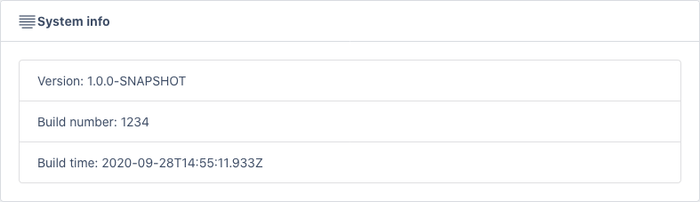
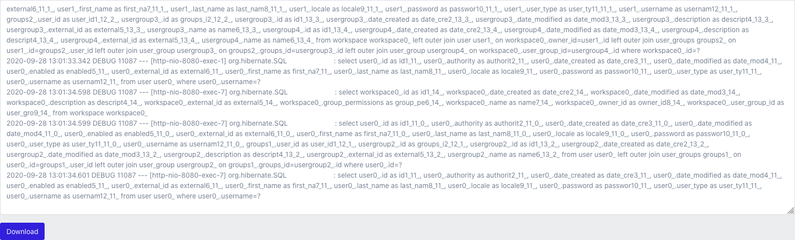
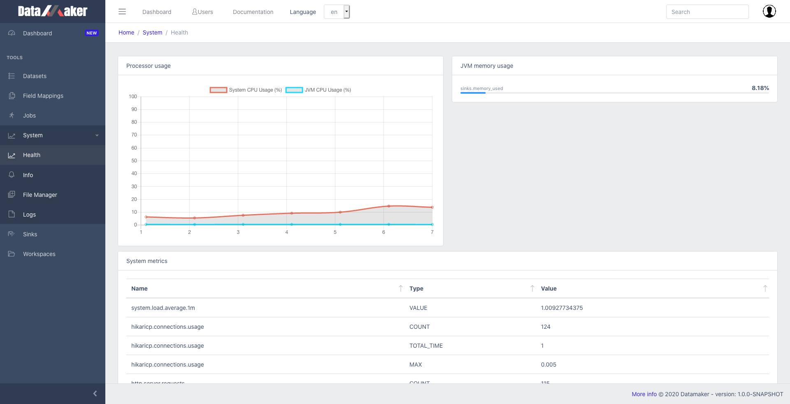

# Troubleshooting

## Version info

Use this information in case you need to contact support.

[Logs viewer](/datamaker/system/info)

## Verify logs

You can monitor the logs for error using from the log viewer page. The view is updated automatically. 
You can also download the logs and attach it to a support ticket.

[Logs viewer](/datamaker/system/logs)

## Performance indicators

You can profile the application from the health page. The metrics are updated continuously.

[Performance](/datamaker/system/health)

# Rest Queries

More information here: [Rest API](%base_url%/rest_api)

## Flush cache
`curl /datamaker/api/system/clearAllCaches`

## Change log level

### Check current log level
`curl /datamaker/actuator/loggers/org.hibernate.SQL {"configuredLevel":null,"effectiveLevel":"INFO"}`

### Change log level
`curl -i -X POST -H 'Content-Type: application/json' -d '{"configuredLevel": "DEBUG"}' /datamaker/actuator/loggers/org.hibernate.SQL`

### Confirm change
`curl /datamaker/actuator/loggers/org.hibernate.SQL {"configuredLevel":null,"effectiveLevel":"DEBUG"}`

## Rebuild search index
`curl /datamaker/api/system/search-index/rebuild`