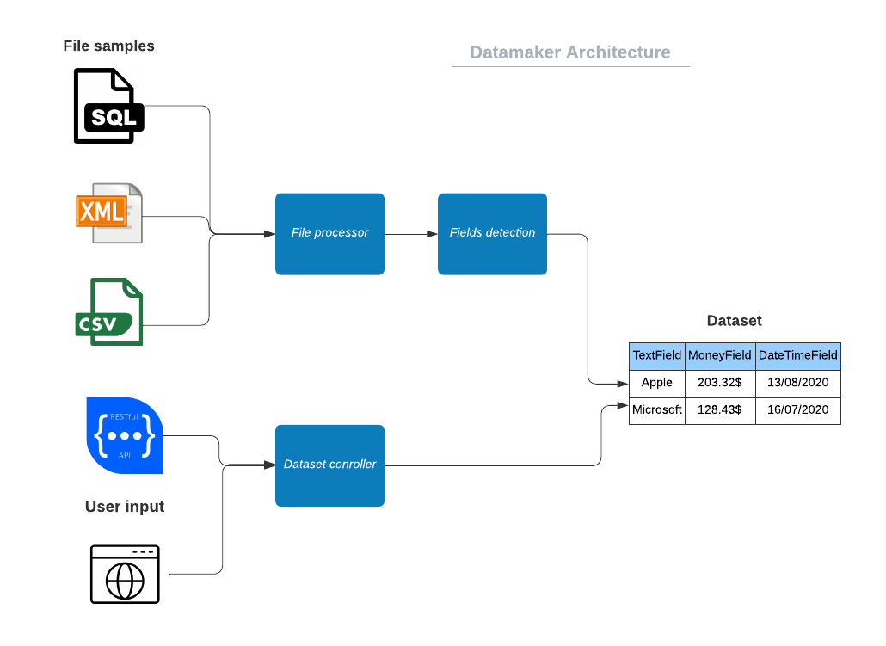
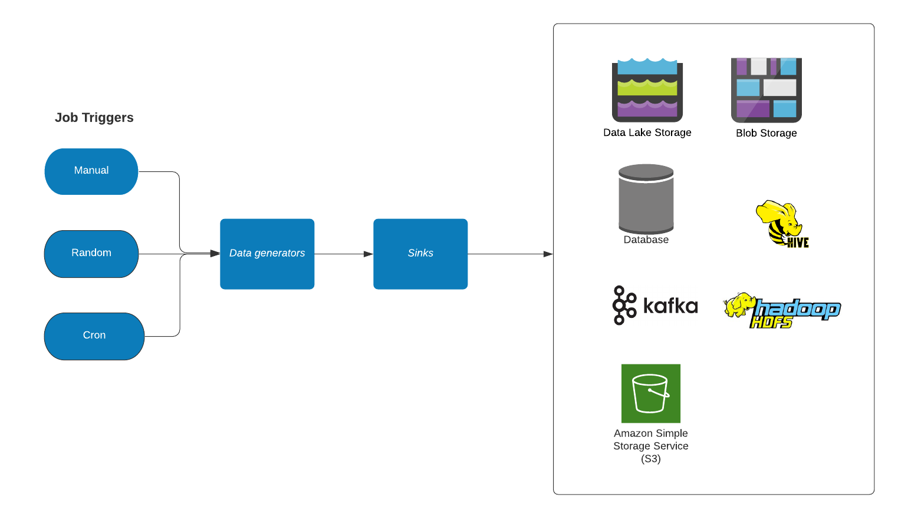

# Overall Architecture

### File Processor
Takes a sample data file as input and convert it automatically in a dataset representation.
The current supported format are: AVRO, CSV, EXCEL, JSON, JSON Schema, PARQUET, XML, TEXT, SQL, XML, XSD

### Dataset Controller
Web service to create dataset manually or programmatically.

### Fields Detection Service
Service that infer data type based on values, field name and schema definition (optional).

### Job Triggers

Jobs can be started manually or automatically (cron, random, burst).

### Data Generator

From an existing dataset, a data generation job will create realistic data that matches all the provided requirements.

### Sinks

The data is sent to a supported sink (data output).

