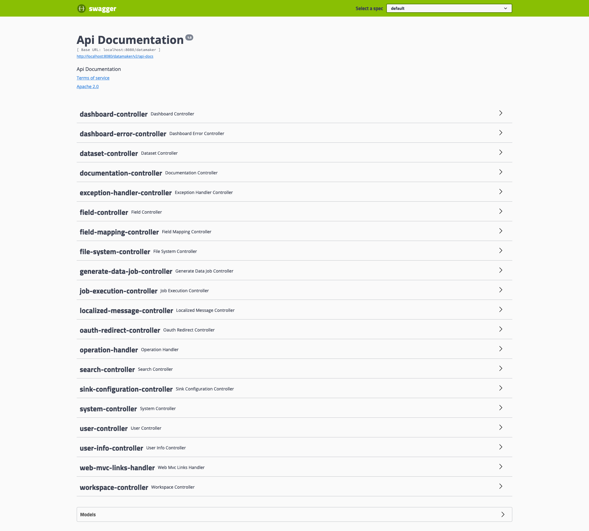

# Rest API

## Authentication
Grab session cookie and reuse it
    
    curl --cookie cookie.txt --cookie-jar cookie.txt -d "username=admin&password=changeme" -X POST http://localhost:8080/datamaker/login

    curl --cookie cookie.txt --cookie-jar cookie.txt http://localhost:8080/datamaker/api/user

## Documentation

[See swagger UI](/datamaker/swagger-ui.html)

