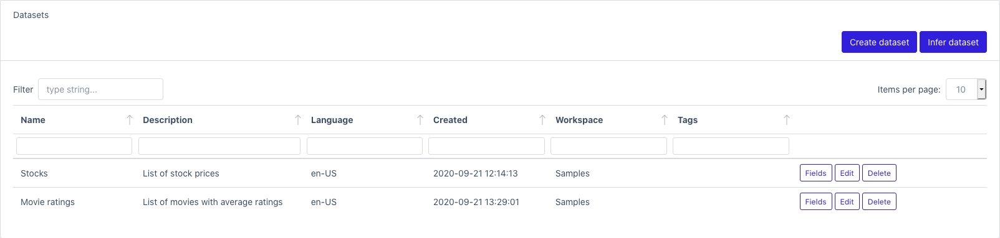
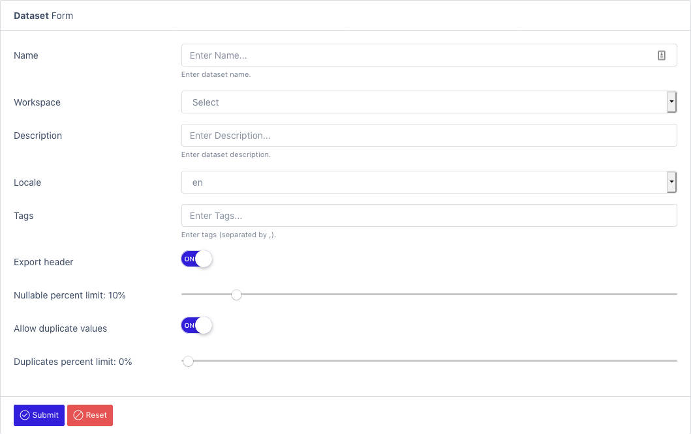
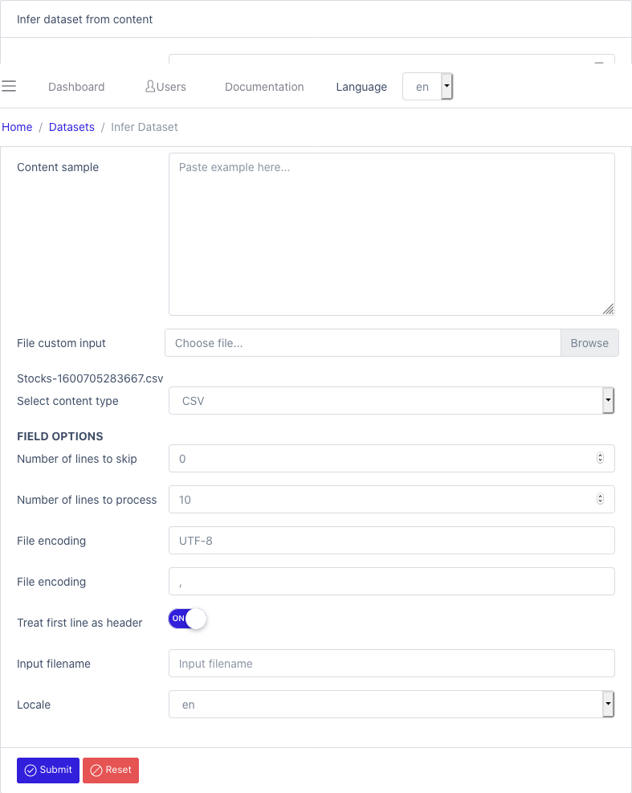

# Datasets
{: .no_toc }

## Table of contents
{: .no_toc .text-delta }

1. TOC
{:toc}

A dataset is the main component of data simulation.
It can represent any kind of data (file, table, topic).

To ease understanding, you can image a dataset as a table of a database.
A table columns with types. A dataset contains different kind of fields.

### To view a list of all datasets: [Datasets](/datamaker/datasets)

From here you can see the list of all datasets available to your user.
You can create a new dataset or infer one using the buttons at the top right section of the page.

From the main results section, you can modify the fields, the dataset or delete it.

## Manual creation

### To create a new dataset: [Create Dataset](/datamaker/datasets/create)

- Name
- Workspace: Select the workspace where the dataset will be located
- Description
- Locale: Will be use as the default locale for data generation (see Fields)
- Tags: Use for helping search index
- Export header: Flag that determines if headers will be exposed in file (example: first line of CSV)
- Nullable percent: How many records (in %) that can contains null value
- Allow duplicate values: Determines if generated dataset can contains duplicate records
- Duplicate percent limit: % of acceptable duplicate records over all the records

## Infer dataset (auto-detect)

### To create a dataset based on a sample file: [InferDataset](/datamaker/datasets/infer)

- Name
- Workspace: Select the workspace where the dataset will be located
- Content sample: Paste an example of the records (or upload file)
- File custom input: File containing some samples
- Select content type: Refer to the [Content Types](datasets#content-types) section to see which settings are needed to process the associated file
- Supported file type:
  - AVRO
  - CSV
  - EXCEL
  - JSON
  - JSON Schema
  - PARQUET
  - TEXT
  - SQL
  - XML
  - XSD

## Content types

### Avro

Description:

Class: ca.breakpoints.datamaker.processor.AvroProcessor

Configuration:

- Locale
    - Type: STRING
    - Default value: en
    - Possible values: en, fr

### Csv

Description:

Class: ca.breakpoints.datamaker.processor.CsvProcessor

Configuration:

- Number of lines to skip
    - Type: NUMERIC
    - Default value: 0
    - Possible values:
- Number of lines to process
    - Type: NUMERIC
    - Default value: 10
    - Possible values:
- File encoding
    - Type: STRING
    - Default value: UTF-8
    - Possible values:
- File encoding
    - Type: STRING
    - Default value: ,
    - Possible values:
- Treat first line as header
    - Type: BOOLEAN
    - Default value: True
    - Possible values: True, False
- Input filename
    - Type: STRING
    - Default value:
    - Possible values:
- Locale
    - Type: STRING
    - Default value: en
    - Possible values: en, fr

### Excel

Description:

Class: ca.breakpoints.datamaker.processor.ExcelProcessor

Configuration:

- Locale
    - Type: STRING
    - Default value: en
    - Possible values: en, fr
- Sheet name
    - Type: STRING
    - Default value:
    - Possible values:
- Sheet number
    - Type: NUMERIC
    - Default value: 0
    - Possible values:
- Process rows
    - Type: BOOLEAN
    - Default value: True
    - Possible values:
- Columns to skip
    - Type: LIST
    - Default value: []
    - Possible values:
- Which row number to use as header
    - Type: NUMERIC
    - Default value:
    - Possible values:
- Which row number to use as datatype
    - Type: NUMERIC
    - Default value:
    - Possible values:
- Number of rows to skip
    - Type: NUMERIC
    - Default value: 0
    - Possible values:
- Number of lines to process
    - Type: NUMERIC
    - Default value: 10
    - Possible values:
- Which column number to use as header
    - Type: NUMERIC
    - Default value:
    - Possible values:
- Which column number to use as datatype
    - Type: NUMERIC
    - Default value:
    - Possible values:
- Which column number to use as comment/description
    - Type: NUMERIC
    - Default value: 0
    - Possible values:

### Json

Description:

Class: ca.breakpoints.datamaker.processor.JsonProcessor

Configuration:

- Input filename
    - Type: STRING
    - Default value:
    - Possible values:
- Locale
    - Type: STRING
    - Default value: en
    - Possible values: en, fr

### Json Schema

Description:

Class: ca.breakpoints.datamaker.processor.JsonSchemaProcessor

Configuration:

### Parquet

Description:

Class: ca.breakpoints.datamaker.processor.ParquetProcessor

Configuration:

- Locale
    - Type: STRING
    - Default value: en
    - Possible values: en, fr

### Sql

Description:

Class: ca.breakpoints.datamaker.processor.SqlProcessor

Configuration:

- Input filename
    - Type: STRING
    - Default value:
    - Possible values:
- Locale
    - Type: STRING
    - Default value: en
    - Possible values: en, fr

### Xml

Description:

Class: ca.breakpoints.datamaker.processor.XmlProcessor

Configuration:

- Input filename
    - Type: STRING
    - Default value:
    - Possible values:
- Locale
    - Type: STRING
    - Default value: en
    - Possible values: en, fr
- XML Root element
    - Type: STRING
    - Default value:
    - Possible values:
- Number of lines to process
    - Type: NUMERIC
    - Default value: 10
    - Possible values:

### Xml Schema

Description:

Class: ca.breakpoints.datamaker.processor.XmlSchemaProcessor

Configuration:

- Locale
    - Type: STRING
    - Default value: en
    - Possible values: en, fr
- Input filename
    - Type: STRING
    - Default value:
    - Possible values: 

