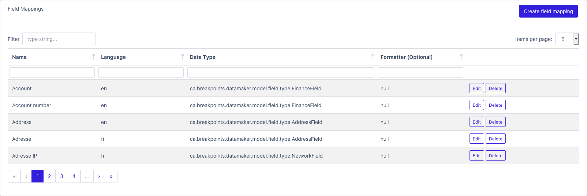
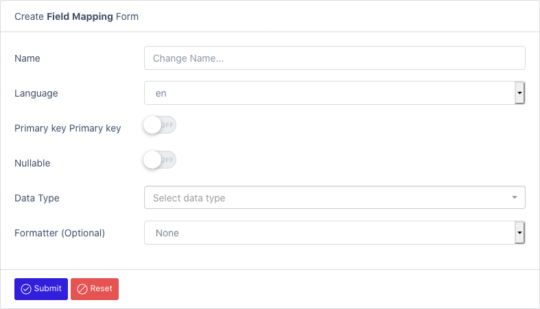

# Field Mappings

Field mapping is used for mapping properties found in sample files and their corresponding field representation.

[FieldMappings](/datamaker/mappings)

For instance, we have a mapping for Address to AddressField.
This configuration is used for dataset inference ([InferDataset](/datamaker/datasets/infer)). 
When sample files are processes (ex: CSV), each header or properties will be compared to field mappings.
If there is a positive match (ex: an address property is found), a field will be automatically created using the mapping configuration found.
This improves the quality of generated data. Instead of matching on data type only, we match the most relevant field.
The data will be more accurate if we are able to match out of the box.
The fallback mechanism of inference is on the data type.
You can also specify for which language the mapping applies to.

[Create field mappings](/datamaker/mappings/create)

- Name
- Language: Choose a locale
- Primary key: Use this option if the field will be referenced by other fields (behave like a foreign key)
- Nullable: Is the field nullable
- Data type: Select a field type
- Formatter: Select a data formatter

