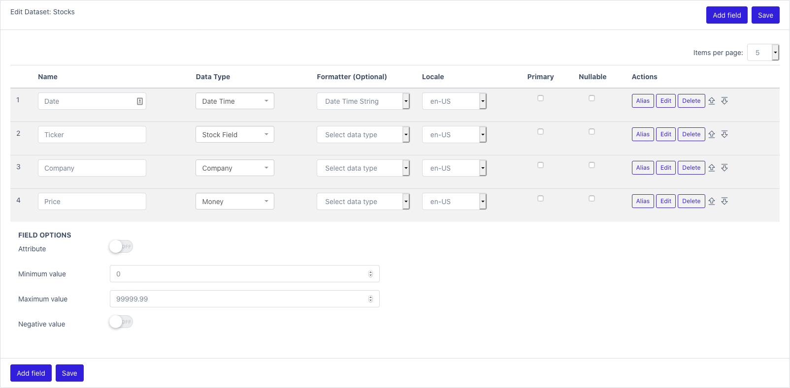

# Fields
{: .no_toc }

## Table of contents
{: .no_toc .text-delta }

1. TOC
{:toc}

### Add a new field to a dataset



Most field are terminal, meaning that they cannot contain other fields.

If you want to represent an array or list, you can use ArrayField.
The array field container, can only contain one type of field.
You can have a list of DoubleField, but you cannot have a list containing different elements.

If you need to include different elements, you can use ComplexField. It behaves like a Map.
Each field is associated with a key. It can be used to represent a JSON file.

If you need to include a field from another dataset, you can use ReferenceField.
It can emulate the behavior of primary key <-> foreign key you find in databases.
For example:

|Table A ||
| -----  | ------ |
|LongField |      id|
|StringField |   name|

|Table B ||
| -----  | ------ |
|ReferenceField |  TableA:id|
|SalaryField |   wages|

- Name
- Data Type: 
  - See [Supported fields](fields#supported-fields)
- Formatter: 
  - See [Formatter section](/datamaker/docs/user/formatters.html)
- Locale
- Primary
- Nullable
- Actions
  - Alias: Copy the field definition for later reuse
  - Edit: Additional settings
  - Move Up
  - Move Down

# Supported Fields

## BUSINESS

### Company

Description: Business/legal entity/company name

Class: ca.breakpoints.datamaker.model.field.type.CompanyField

Configuration:

- Company type
    - Type: STRING
    - Default value: NAME
    - Possible values: NAME, BUZZWORD, CATCH_PHRASE, PROFESSION, LOGO, INDUSTRY, URL, SUFFIX

## CUSTOM

### Choice list

Description: List of pre-defined values

Class: ca.breakpoints.datamaker.model.field.type.ChoiceField

Configuration:

- Value type
    - Type: STRING
    - Default value: STRING
    - Possible values: NUMERIC, STRING
- Choices values
    - Type: LIST
    - Default value: []
    - Possible values:

### Nested field (map)

Description: Will contains other fields

Class: ca.breakpoints.datamaker.model.field.type.ComplexField

Configuration:

- Element values
    - Type: FIELDS
    - Default value: []
    - Possible values:

### Constant value

Description: Value that never changes

Class: ca.breakpoints.datamaker.model.field.type.ConstantField

Configuration:

- Constant value
    - Type: STRING
    - Default value:
    - Possible values:
- Value type
    - Type: STRING
    - Default value: STRING
    - Possible values: BOOLEAN, DATE, NUMERIC, STRING

### Crypto Field

Description: Hashed value: MD5, SHA-256

Class: ca.breakpoints.datamaker.model.field.type.CryptoField

Configuration:

- Algorithm
    - Type: STRING
    - Default value: SHA256
    - Possible values: BCRYPT, MD5, SHA1, SHA256, SHA512, SIMPLE

### Custom string

Description:
```text
Returns a string with the '#' characters in the parameter replaced with random digits between 0-9 inclusive.
Returns a string with the '?' characters in the parameter replaced with random alphabetic characters.
Example: FLIGHT-???-#### will generate a value of FLIGHT-ZUK-8943
```

Class: ca.breakpoints.datamaker.model.field.type.CustomField

Configuration:

- Pattern
    - Type: STRING
    - Default value:
    - Possible values:
- Uppercase value
    - Type: BOOLEAN
    - Default value: False
    - Possible values:

### Empty value

Description: Empty value field

Class: ca.breakpoints.datamaker.model.field.type.EmptyField

Configuration:

- Empty value
    - Type: STRING
    - Default value:
    - Possible values:

### File

Description: Filename

Class: ca.breakpoints.datamaker.model.field.type.FileField

Configuration:

- File data type
    - Type: STRING
    - Default value: NAME
    - Possible values: NAME, EXTENSION, MIME_TYPE
- Directory name
    - Type: STRING
    - Default value: None
    - Possible values:
- File name
    - Type: STRING
    - Default value: None
    - Possible values:
- Path separator
    - Type: STRING
    - Default value: None
    - Possible values:
- File extension
    - Type: STRING
    - Default value: None
    - Possible values:

### Finance

Description: Financial

Class: ca.breakpoints.datamaker.model.field.type.FinanceField

Configuration:

- Finance type
    - Type: STRING
    - Default value: BIC
    - Possible values: VAT_NUMBER, IBAN, CC, BIC, ACCOUNT_NUMBER, TAX_NUMBER

### Item identification number

Description: Item identification number

Class: ca.breakpoints.datamaker.model.field.type.IdentificationNumberField

Configuration:

- Identification number type
    - Type: STRING
    - Default value: UPC
    - Possible values: BARCODE, UPC, ISBN, ASIN, ISBN10, ISBN13, IMEI, EAN8, EAN13, GTIN8, GTIN13

### Multimedia Field

Description: Multimedia content

Class: ca.breakpoints.datamaker.model.field.type.MultimediaField

Configuration:


### Reference

Description: A reference to another field in the current dataset

Class: ca.breakpoints.datamaker.model.field.type.ReferenceField

Configuration:

- Reference value
    - Type: REFERENCE
    - Default value: None
    - Possible values:

### Regex expression

Description: Regular expression

Class: ca.breakpoints.datamaker.model.field.type.RegexField

Configuration:

- Pattern
    - Type: STRING
    - Default value: \w{10}
    - Possible values:

### Script Field

Description: Scripting (Uses SpEL expression language)

Class: ca.breakpoints.datamaker.model.field.type.ScriptField

Configuration:

- Script
    - Type: STRING
    - Default value: T(java.lang.Math).random() * 100.0
    - Possible values:
- Script variable names
    - Type: LIST
    - Default value: []
    - Possible values:
- Script variable values
    - Type: LIST
    - Default value: []
    - Possible values:

### Sequence

Description: Primary key

Class: ca.breakpoints.datamaker.model.field.type.SequenceField

Configuration:

- Minimum value
    - Type: NUMERIC
    - Default value: 1
    - Possible values:
- Initial value
    - Type: NUMERIC
    - Default value: 0
    - Possible values:

### Sgml Field

Description: HTML/XML documents

Class: ca.breakpoints.datamaker.model.field.type.SgmlField

Configuration:

- SGL Document type
    - Type: STRING
    - Default value: HTML
    - Possible values: HTML, XML

### Text

Description: Generated text (locale based dictionary)

Class: ca.breakpoints.datamaker.model.field.type.TextField

Configuration:

- Text type
    - Type: STRING
    - Default value: WORD
    - Possible values: WORD, WORDS, SENTENCES, PARAGRAPHS
- Length
    - Type: NUMERIC
    - Default value: 25
    - Possible values:
- Exclude stop words
    - Type: BOOLEAN
    - Default value: False
    - Possible values:

### Uuid Field

Description: Immutable universally unique identifier (UUID)

Class: ca.breakpoints.datamaker.model.field.type.UuidField

Configuration:


## IDENTITY

### Age

Description: Age, Integer [1-100]

Class: ca.breakpoints.datamaker.model.field.type.AgeField

Configuration:

- Mininum age
    - Type: NUMERIC
    - Default value: 1
    - Possible values: 1, 125
- Maximum age
    - Type: NUMERIC
    - Default value: 125
    - Possible values: 1, 125

### Demographic

Description: Demographic

Class: ca.breakpoints.datamaker.model.field.type.DemographicField

Configuration:

- Demographic type
    - Type: STRING
    - Default value: GENDER
    - Possible values: MARITAL_STATUS, GENDER, RACE, EDUCATION, DEMONYM

### Email address

Description: Email address

Class: ca.breakpoints.datamaker.model.field.type.EmailField

Configuration:


### Name

Description: Full name

Class: ca.breakpoints.datamaker.model.field.type.NameField

Configuration:

- Name type
    - Type: STRING
    - Default value: FULL
    - Possible values: FULL, FIRST, LAST, MIDDLE, TITLE, PREFIX, SUFFIX

### Phone number

Description: Home phone

Class: ca.breakpoints.datamaker.model.field.type.PhoneField

Configuration:

- Name type
    - Type: STRING
    - Default value: HOME
    - Possible values: MOBILE, HOME, BUSINESS, FAX, EXTENSION

### Social Network Field

Description: Social network

Class: ca.breakpoints.datamaker.model.field.type.SocialNetworkField

Configuration:

- Social network type
    - Type: STRING
    - Default value: PROFILE_NAME
    - Possible values: PROFILE_PICTURE, SOCIAL_HANDLE, PROFILE_NAME

### Social Number Field

Description: Social security number

Class: ca.breakpoints.datamaker.model.field.type.SocialNumberField

Configuration:


### Url Field

Description: Generic URL address

Class: ca.breakpoints.datamaker.model.field.type.UrlField

Configuration:


## JOB

### Job

Description: Job position

Class: ca.breakpoints.datamaker.model.field.type.JobField

Configuration:

- Job type
    - Type: STRING
    - Default value: TITLE
    - Possible values: TITLE, SENIORITY, KEY_SKILLS, POSITION, FIELD

## MONEY

### Credit Card Field

Description: Credit card number

Class: ca.breakpoints.datamaker.model.field.type.CreditCardField

Configuration:

- Credit card type
    - Type: STRING
    - Default value: RANDOM
    - Possible values: RANDOM, VISA, AMERICAN_EXPRESS, DANKORT, DINERS_CLUB, DISCOVER, FORBRUGSFORENINGEN, JCB, LASER, MASTERCARD, SOLO, SWITCH

### Money

Description: Money/any currency

Class: ca.breakpoints.datamaker.model.field.type.MoneyField

Configuration:

- Minimum value
    - Type: NUMERIC
    - Default value: 0.0
    - Possible values: -9223372036854775808, 0
- Maximum value
    - Type: NUMERIC
    - Default value: 99999.99
    - Possible values: 0, 9223372036854775807
- Negative value
    - Type: BOOLEAN
    - Default value: False
    - Possible values:

## MULTIMEDIA

### Image Field

Description: Image content

Class: ca.breakpoints.datamaker.model.field.type.ImageField

Configuration:

- Image format type
    - Type: STRING
    - Default value: JPEG
    - Possible values: JPEG, PNG, GIF, BMP, WBMP, TIF, TIFF
- Image width
    - Type: NUMERIC
    - Default value: 640
    - Possible values:
- Image height
    - Type: NUMERIC
    - Default value: 480
    - Possible values:

## NETWORK

### Network related

Description: IPv4/IPv6/MAC address

Class: ca.breakpoints.datamaker.model.field.type.NetworkField

Configuration:

- Network address type
    - Type: STRING
    - Default value: IPv4
    - Possible values: MAC, IPv4, IPv6, HOSTNAME, IPv4_CIDR, IPv6_CIDR
- Use private range only
    - Type: BOOLEAN
    - Default value: False
    - Possible values:

### Password

Description: Password

Class: ca.breakpoints.datamaker.model.field.type.PasswordField

Configuration:

- Minimum password length
    - Type: NUMERIC
    - Default value: 8
    - Possible values: 0, 10000
- Maximum password length
    - Type: NUMERIC
    - Default value: 16
    - Possible values: 0, 10000
- Include digits
    - Type: BOOLEAN
    - Default value: True
    - Possible values:
- Include special characters
    - Type: BOOLEAN
    - Default value: False
    - Possible values:
- Include upper case
    - Type: BOOLEAN
    - Default value: False
    - Possible values:

### Username Field

Description: Username

Class: ca.breakpoints.datamaker.model.field.type.UsernameField

Configuration:


## PHYSICAL_LOCATION

### Address

Description: Fully formatted address using locale

Class: ca.breakpoints.datamaker.model.field.type.AddressField

Configuration:

- Address type
    - Type: STRING
    - Default value: FULL
    - Possible values: FULL, STREET_NAME, STREET_WITH_NUMBER, ZIP_CODE, CEDEX, POSTAL_CODE, COUNTRY, STATE, PROVINCE, CITY

### GeoJSON

Description: 
```text
Represents a GeoJSON coordinates.

Degrees of latitude are parallel so the distance between each degree remains almost constant but since degrees of longitude are farthest apart at the equator and converge at the poles, their distance varies greatly.

Each degree of latitude is approximately 69 miles (111 kilometers) apart. The range varies (due to the earth's slightly ellipsoid shape) from 68.703 miles (110.567 km) at the equator to 69.407 (111.699 km) at the poles. This is convenient because each minute (1/60th of a degree) is approximately one [nautical] mile.

A degree of longitude is widest at the equator at 69.172 miles (111.321) and gradually shrinks to zero at the poles. At 40° north or south the distance between a degree of longitude is 53 miles (85 km)

What is the "right-hand-rule"?
When you construct a polygon, you can order the coordinates in one direction or another. If you’re drawing a circle, you might start on the left and go counter-clockwise around to meet the original point. Or, you might go clockwise.

Here is the specification:

A linear ring MUST follow the right-hand rule with respect to the area it bounds, i.e., exterior rings are counterclockwise, and holes are clockwise.
```

Class: ca.breakpoints.datamaker.model.field.type.GeographicField

Configuration:

- Geographic type
    - Type: STRING
    - Default value: POINT
    - Possible values: LATITUDE, LONGITUDE, COORDINATES, POINT, LINE_STRING, MULTI_LINE_STRING, POLYGON, MULTI_POLYGON, FEATURE, FEATURE_COLLECTION
- Object size
    - Type: NUMERIC
    - Default value: 10
    - Possible values: 0, 32767
- Steps delta factor
    - Type: NUMERIC
    - Default value: 1.0
    - Possible values: 0, 3.4028235e+38
- Country bounding box
    - Type: STRING
    - Default value: None
    - Possible values: Afghanistan, Angola, Albania, United Arab Emirates, Argentina, Armenia, Antarctica, Fr. S. and Antarctic Lands, Australia, Austria, Azerbaijan, Burundi, Belgium, Benin, Burkina Faso, Bangladesh, Bulgaria, Bahamas, Bosnia and Herz., Belarus, Belize, Bolivia, Brazil, Brunei, Bhutan, Botswana, Central African Rep., Canada, Switzerland, Chile, China, Ivory Coast, Cameroon, Congo (Kinshasa), Congo (Brazzaville), Colombia, Costa Rica, Cuba, Cyprus, Czech Rep., Germany, Djibouti, Denmark, Dominican Rep., Algeria, Ecuador, Egypt, Eritrea, Spain, Estonia, Ethiopia, Finland, Fiji, Falkland Is., France, Gabon, United Kingdom, Georgia, Ghana, Guinea, Gambia, Guinea Bissau, Eq. Guinea, Greece, Greenland, Guatemala, Guyana, Honduras, Croatia, Haiti, Hungary, Indonesia, India, Ireland, Iran, Iraq, Iceland, Israel, Italy, Jamaica, Jordan, Japan, Kazakhstan, Kenya, Kyrgyzstan, Cambodia, S. Korea, Kuwait, Laos, Lebanon, Liberia, Libya, Sri Lanka, Lesotho, Lithuania, Luxembourg, Latvia, Morocco, Moldova, Madagascar, Mexico, Macedonia, Mali, Myanmar, Montenegro, Mongolia, Mozambique, Mauritania, Malawi, Malaysia, Namibia, New Caledonia, Niger, Nigeria, Nicaragua, Netherlands, Norway, Nepal, New Zealand, Oman, Pakistan, Panama, Peru, Philippines, Papua New Guinea, Poland, Puerto Rico, N. Korea, Portugal, Paraguay, Qatar, Romania, Russia, Rwanda, Saudi Arabia, Sudan, S. Sudan, Senegal, Solomon Is., Sierra Leone, El Salvador, Somalia, Serbia, Suriname, Slovakia, Slovenia, Sweden, Swaziland, Syria, Chad, Togo, Thailand, Tajikistan, Turkmenistan, East Timor, Trinidad and Tobago, Tunisia, Turkey, Taiwan, Tanzania, Uganda, Ukraine, Uruguay, United States, Uzbekistan, Venezuela, Vietnam, Vanuatu, West Bank, Yemen, South Africa, Zambia, Zimbabwe
- Custom bounding box
    - Type: STRING
    - Default value:
    - Possible values:

## PRIMITIVE

### List of other fields

Description: List of objects

Class: ca.breakpoints.datamaker.model.field.type.ArrayField

Configuration:

- Number of elements
    - Type: NUMERIC
    - Default value: 5
    - Possible values:
- Field element
    - Type: FIELD
    - Default value: None
    - Possible values:

### Big Integer Field

Description: Big integer

Class: ca.breakpoints.datamaker.model.field.type.BigIntegerField

Configuration:

- Bit length
    - Type: NUMERIC
    - Default value: 64
    - Possible values:
- Minimum value
  - Type: STRING
  - Default value: 0
  - Possible values:
- Maximum value
  - Type: STRING
  - Default value: 9999999999999999999999999999999999999999999999
  - Possible values:
- Negative values
    - Type: BOOLEAN
    - Default value: False
    - Possible values:

### Boolean value

Description: Boolean value

Class: ca.breakpoints.datamaker.model.field.type.BooleanField

Configuration:


### Bytes Field

Description: Bytes

Class: ca.breakpoints.datamaker.model.field.type.BytesField

Configuration:

- Bytes length
    - Type: NUMERIC
    - Default value: 25
    - Possible values:

### Date Time

Description: Date

Class: ca.breakpoints.datamaker.model.field.type.DateTimeField

Configuration:

- Timezone
    - Type: STRING
    - Default value: UTC
    - Possible values: Asia/Aden, America/Cuiaba, Etc/GMT+9, Etc/GMT+8, Africa/Nairobi, America/Marigot, Asia/Aqtau, Pacific/Kwajalein, America/El_Salvador, Asia/Pontianak, Africa/Cairo, Pacific/Pago_Pago, Africa/Mbabane, Asia/Kuching, Pacific/Honolulu, Pacific/Rarotonga, America/Guatemala, Australia/Hobart, Europe/London, America/Belize, America/Panama, Asia/Chungking, America/Managua, America/Indiana/Petersburg, Asia/Yerevan, Europe/Brussels, GMT, Europe/Warsaw, America/Chicago, Asia/Kashgar, Chile/Continental, Pacific/Yap, CET, Etc/GMT-1, Etc/GMT-0, Europe/Jersey, America/Tegucigalpa, Etc/GMT-5, Europe/Istanbul, America/Eirunepe, Etc/GMT-4, America/Miquelon, Etc/GMT-3, Europe/Luxembourg, Etc/GMT-2, Etc/GMT-9, America/Argentina/Catamarca, Etc/GMT-8, Etc/GMT-7, Etc/GMT-6, Europe/Zaporozhye, Canada/Yukon, Canada/Atlantic, Atlantic/St_Helena, Australia/Tasmania, Libya, Europe/Guernsey, America/Grand_Turk, Asia/Samarkand, America/Argentina/Cordoba, Asia/Phnom_Penh, Africa/Kigali, Asia/Almaty, US/Alaska, Asia/Dubai, Europe/Isle_of_Man, America/Araguaina, Cuba, Asia/Novosibirsk, America/Argentina/Salta, Etc/GMT+3, Africa/Tunis, Etc/GMT+2, Etc/GMT+1, Pacific/Fakaofo, Africa/Tripoli, Etc/GMT+0, Israel, Africa/Banjul, Etc/GMT+7, Indian/Comoro, Etc/GMT+6, Etc/GMT+5, Etc/GMT+4, Pacific/Port_Moresby, US/Arizona, Antarctica/Syowa, Indian/Reunion, Pacific/Palau, Europe/Kaliningrad, America/Montevideo, Africa/Windhoek, Asia/Karachi, Africa/Mogadishu, Australia/Perth, Brazil/East, Etc/GMT, Asia/Chita, Pacific/Easter, Antarctica/Davis, Antarctica/McMurdo, Asia/Macao, America/Manaus, Africa/Freetown, Europe/Bucharest, Asia/Tomsk, America/Argentina/Mendoza, Asia/Macau, Europe/Malta, Mexico/BajaSur, Pacific/Tahiti, Africa/Asmera, Europe/Busingen, America/Argentina/Rio_Gallegos, Africa/Malabo, Europe/Skopje, America/Catamarca, America/Godthab, Europe/Sarajevo, Australia/ACT, GB-Eire, Africa/Lagos, America/Cordoba, Europe/Rome, Asia/Dacca, Indian/Mauritius, Pacific/Samoa, America/Regina, America/Fort_Wayne, America/Dawson_Creek, Africa/Algiers, Europe/Mariehamn, America/St_Johns, America/St_Thomas, Europe/Zurich, America/Anguilla, Asia/Dili, America/Denver, Africa/Bamako, Europe/Saratov, GB, Mexico/General, Pacific/Wallis, Europe/Gibraltar, Africa/Conakry, Africa/Lubumbashi, Asia/Istanbul, America/Havana, NZ-CHAT, Asia/Choibalsan, America/Porto_Acre, Asia/Omsk, Europe/Vaduz, US/Michigan, Asia/Dhaka, America/Barbados, Europe/Tiraspol, Atlantic/Cape_Verde, Asia/Yekaterinburg, America/Louisville, Pacific/Johnston, Pacific/Chatham, Europe/Ljubljana, America/Sao_Paulo, Asia/Jayapura, America/Curacao, Asia/Dushanbe, America/Guyana, America/Guayaquil, America/Martinique, Portugal, Europe/Berlin, Europe/Moscow, Europe/Chisinau, America/Puerto_Rico, America/Rankin_Inlet, Pacific/Ponape, Europe/Stockholm, Europe/Budapest, America/Argentina/Jujuy, Australia/Eucla, Asia/Shanghai, Universal, Europe/Zagreb, America/Port_of_Spain, Europe/Helsinki, Asia/Beirut, Asia/Tel_Aviv, Pacific/Bougainville, US/Central, Africa/Sao_Tome, Indian/Chagos, America/Cayenne, Asia/Yakutsk, Pacific/Galapagos, Australia/North, Europe/Paris, Africa/Ndjamena, Pacific/Fiji, America/Rainy_River, Indian/Maldives, Australia/Yancowinna, SystemV/AST4, Asia/Oral, America/Yellowknife, Pacific/Enderbury, America/Juneau, Australia/Victoria, America/Indiana/Vevay, Asia/Tashkent, Asia/Jakarta, Africa/Ceuta, Asia/Barnaul, America/Recife, America/Buenos_Aires, America/Noronha, America/Swift_Current, Australia/Adelaide, America/Metlakatla, Africa/Djibouti, America/Paramaribo, Asia/Qostanay, Europe/Simferopol, Europe/Sofia, Africa/Nouakchott, Europe/Prague, America/Indiana/Vincennes, Antarctica/Mawson, America/Kralendijk, Antarctica/Troll, Europe/Samara, Indian/Christmas, America/Antigua, Pacific/Gambier, America/Indianapolis, America/Inuvik, America/Iqaluit, Pacific/Funafuti, UTC, Antarctica/Macquarie, Canada/Pacific, America/Moncton, Africa/Gaborone, Pacific/Chuuk, Asia/Pyongyang, America/St_Vincent, Asia/Gaza, Etc/Universal, PST8PDT, Atlantic/Faeroe, Asia/Qyzylorda, Canada/Newfoundland, America/Kentucky/Louisville, America/Yakutat, Asia/Ho_Chi_Minh, Antarctica/Casey, Europe/Copenhagen, Africa/Asmara, Atlantic/Azores, Europe/Vienna, ROK, Pacific/Pitcairn, America/Mazatlan, Australia/Queensland, Pacific/Nauru, Europe/Tirane, Asia/Kolkata, SystemV/MST7, Australia/Canberra, MET, Australia/Broken_Hill, Europe/Riga, America/Dominica, Africa/Abidjan, America/Mendoza, America/Santarem, Kwajalein, America/Asuncion, Asia/Ulan_Bator, NZ, America/Boise, Australia/Currie, EST5EDT, Pacific/Guam, Pacific/Wake, Atlantic/Bermuda, America/Costa_Rica, America/Dawson, Asia/Chongqing, Eire, Europe/Amsterdam, America/Indiana/Knox, America/North_Dakota/Beulah, Africa/Accra, Atlantic/Faroe, Mexico/BajaNorte, America/Maceio, Etc/UCT, Pacific/Apia, GMT0, America/Atka, Pacific/Niue, Australia/Lord_Howe, Europe/Dublin, Pacific/Truk, MST7MDT, America/Monterrey, America/Nassau, America/Jamaica, Asia/Bishkek, America/Atikokan, Atlantic/Stanley, Australia/NSW, US/Hawaii, SystemV/CST6, Indian/Mahe, Asia/Aqtobe, America/Sitka, Asia/Vladivostok, Africa/Libreville, Africa/Maputo, Zulu, America/Kentucky/Monticello, Africa/El_Aaiun, Africa/Ouagadougou, America/Coral_Harbour, Pacific/Marquesas, Brazil/West, America/Aruba, America/North_Dakota/Center, America/Cayman, Asia/Ulaanbaatar, Asia/Baghdad, Europe/San_Marino, America/Indiana/Tell_City, America/Tijuana, Pacific/Saipan, SystemV/YST9, Africa/Douala, America/Chihuahua, America/Ojinaga, Asia/Hovd, America/Anchorage, Chile/EasterIsland, America/Halifax, Antarctica/Rothera, America/Indiana/Indianapolis, US/Mountain, Asia/Damascus, America/Argentina/San_Luis, America/Santiago, Asia/Baku, America/Argentina/Ushuaia, Atlantic/Reykjavik, Africa/Brazzaville, Africa/Porto-Novo, America/La_Paz, Antarctica/DumontDUrville, Asia/Taipei, Antarctica/South_Pole, Asia/Manila, Asia/Bangkok, Africa/Dar_es_Salaam, Poland, Atlantic/Madeira, Antarctica/Palmer, America/Thunder_Bay, Africa/Addis_Ababa, Asia/Yangon, Europe/Uzhgorod, Brazil/DeNoronha, Asia/Ashkhabad, Etc/Zulu, America/Indiana/Marengo, America/Creston, America/Punta_Arenas, America/Mexico_City, Antarctica/Vostok, Asia/Jerusalem, Europe/Andorra, US/Samoa, PRC, Asia/Vientiane, Pacific/Kiritimati, America/Matamoros, America/Blanc-Sablon, Asia/Riyadh, Iceland, Pacific/Pohnpei, Asia/Ujung_Pandang, Atlantic/South_Georgia, Europe/Lisbon, Asia/Harbin, Europe/Oslo, Asia/Novokuznetsk, CST6CDT, Atlantic/Canary, America/Knox_IN, Asia/Kuwait, SystemV/HST10, Pacific/Efate, Africa/Lome, America/Bogota, America/Menominee, America/Adak, Pacific/Norfolk, Europe/Kirov, America/Resolute, Pacific/Tarawa, Africa/Kampala, Asia/Krasnoyarsk, Greenwich, SystemV/EST5, America/Edmonton, Europe/Podgorica, Australia/South, Canada/Central, Africa/Bujumbura, America/Santo_Domingo, US/Eastern, Europe/Minsk, Pacific/Auckland, Africa/Casablanca, America/Glace_Bay, Canada/Eastern, Asia/Qatar, Europe/Kiev, Singapore, Asia/Magadan, SystemV/PST8, America/Port-au-Prince, Europe/Belfast, America/St_Barthelemy, Asia/Ashgabat, Africa/Luanda, America/Nipigon, Atlantic/Jan_Mayen, Brazil/Acre, Asia/Muscat, Asia/Bahrain, Europe/Vilnius, America/Fortaleza, Etc/GMT0, US/East-Indiana, America/Hermosillo, America/Cancun, Africa/Maseru, Pacific/Kosrae, Africa/Kinshasa, Asia/Kathmandu, Asia/Seoul, Australia/Sydney, America/Lima, Australia/LHI, America/St_Lucia, Europe/Madrid, America/Bahia_Banderas, America/Montserrat, Asia/Brunei, America/Santa_Isabel, Canada/Mountain, America/Cambridge_Bay, Asia/Colombo, Australia/West, Indian/Antananarivo, Australia/Brisbane, Indian/Mayotte, US/Indiana-Starke, Asia/Urumqi, US/Aleutian, Europe/Volgograd, America/Lower_Princes, America/Vancouver, Africa/Blantyre, America/Rio_Branco, America/Danmarkshavn, America/Detroit, America/Thule, Africa/Lusaka, Asia/Hong_Kong, Iran, America/Argentina/La_Rioja, Africa/Dakar, SystemV/CST6CDT, America/Tortola, America/Porto_Velho, Asia/Sakhalin, Etc/GMT+10, America/Scoresbysund, Asia/Kamchatka, Asia/Thimbu, Africa/Harare, Etc/GMT+12, Etc/GMT+11, Navajo, America/Nome, Europe/Tallinn, Turkey, Africa/Khartoum, Africa/Johannesburg, Africa/Bangui, Europe/Belgrade, Jamaica, Africa/Bissau, Asia/Tehran, WET, Europe/Astrakhan, Africa/Juba, America/Campo_Grande, America/Belem, Etc/Greenwich, Asia/Saigon, America/Ensenada, Pacific/Midway, America/Jujuy, Africa/Timbuktu, America/Bahia, America/Goose_Bay, America/Virgin, America/Pangnirtung, Asia/Katmandu, America/Phoenix, Africa/Niamey, America/Whitehorse, Pacific/Noumea, Asia/Tbilisi, America/Montreal, Asia/Makassar, America/Argentina/San_Juan, Hongkong, UCT, Asia/Nicosia, America/Indiana/Winamac, SystemV/MST7MDT, America/Argentina/ComodRivadavia, America/Boa_Vista, America/Grenada, Asia/Atyrau, Australia/Darwin, Asia/Khandyga, Asia/Kuala_Lumpur, Asia/Famagusta, Asia/Thimphu, Asia/Rangoon, Europe/Bratislava, Asia/Calcutta, America/Argentina/Tucuman, Asia/Kabul, Indian/Cocos, Japan, Pacific/Tongatapu, America/New_York, Etc/GMT-12, Etc/GMT-11, America/Nuuk, Etc/GMT-10, SystemV/YST9YDT, Europe/Ulyanovsk, Etc/GMT-14, Etc/GMT-13, W-SU, America/Merida, EET, America/Rosario, Canada/Saskatchewan, America/St_Kitts, Arctic/Longyearbyen, America/Fort_Nelson, America/Caracas, America/Guadeloupe, Asia/Hebron, Indian/Kerguelen, SystemV/PST8PDT, Africa/Monrovia, Asia/Ust-Nera, Egypt, Asia/Srednekolymsk, America/North_Dakota/New_Salem, Asia/Anadyr, Australia/Melbourne, Asia/Irkutsk, America/Shiprock, America/Winnipeg, Europe/Vatican, Asia/Amman, Etc/UTC, SystemV/AST4ADT, Asia/Tokyo, America/Toronto, Asia/Singapore, Australia/Lindeman, America/Los_Angeles, SystemV/EST5EDT, Pacific/Majuro, America/Argentina/Buenos_Aires, Europe/Nicosia, Pacific/Guadalcanal, Europe/Athens, US/Pacific, Europe/Monaco
- Datetime type
    - Type: STRING
    - Default value: CURRENT
    - Possible values: DATE_OF_BIRTH, PAST, FUTURE, CURRENT, DATE_ONLY, TIME_ONLY
- Start date
    - Type: DATE
    - Default value:
    - Possible values:
- Start time
    - Type: TIME
    - Default value: 00:00:00
    - Possible values:
- End date
    - Type: DATE
    - Default value:
    - Possible values:
- End time
    - Type: TIME
    - Default value: 23:59:59
    - Possible values:
- Time unit
    - Type: STRING
    - Default value: DAYS
    - Possible values: NANOSECONDS, MICROSECONDS, MILLISECONDS, SECONDS, MINUTES, HOURS, DAYS
- At most (used with past and future option)
    - Type: NUMERIC
    - Default value: 365
    - Possible values:

### Big decimal

Description: Big decimal number. Useful for money calculation.

Class: ca.breakpoints.datamaker.model.field.type.DecimalField

Configuration:

- Minimum value
    - Type: NUMERIC
    - Default value: 0.0
    - Possible values:
- Maximum value
    - Type: NUMERIC
    - Default value: 1.7976931348623157e+308
    - Possible values:

### Floating point: double precision

Description: Floating point: double precision

Class: ca.breakpoints.datamaker.model.field.type.DoubleField

Configuration:

- Minimum value
    - Type: NUMERIC
    - Default value: 0.0
    - Possible values: -9223372036854775808, 0
- Maximum value
    - Type: NUMERIC
    - Default value: 1000.0
    - Possible values: 0, 9223372036854775807
- Maximum number of decimals
    - Type: NUMERIC
    - Default value: 16
    - Possible values:

### Duration Field

Description: Duration

Class: ca.breakpoints.datamaker.model.field.type.DurationField

Configuration:

- Format
    - Type: STRING
    - Default value: P5DT5H5M5.4S
    - Possible values:

### Floating point: simple precision

Description: Floating point

Class: ca.breakpoints.datamaker.model.field.type.FloatField

Configuration:

- Minimum value
    - Type: NUMERIC
    - Default value: 0
    - Possible values: 0, 1.4e-45
- Maximum value
    - Type: NUMERIC
    - Default value: 32767
    - Possible values: 0, 3.4028235e+38
- Maximum number of decimals
    - Type: NUMERIC
    - Default value: 7
    - Possible values: 0, 7

### Integer Field

Description: Number

Class: ca.breakpoints.datamaker.model.field.type.IntegerField

Configuration:

- Minimum value
    - Type: NUMERIC
    - Default value: 0
    - Possible values: -2147483648, 0
- Maximum value
    - Type: NUMERIC
    - Default value: 100000
    - Possible values: 0, 2147483647
- Negative value
    - Type: BOOLEAN
    - Default value: False
    - Possible values:

### Long

Description: Number

Class: ca.breakpoints.datamaker.model.field.type.LongField

Configuration:

- Minimum value
    - Type: NUMERIC
    - Default value: 0
    - Possible values: -2147483648, 0
- Maximum value
    - Type: NUMERIC
    - Default value: 1000
    - Possible values: 0, 2147483647
- Negative value
    - Type: BOOLEAN
    - Default value: False
    - Possible values:

### Null value

Description: Null value field

Class: ca.breakpoints.datamaker.model.field.type.NullField

Configuration:


### Period Field

Description: Period

Class: ca.breakpoints.datamaker.model.field.type.PeriodField

Configuration:

- Format
    - Type: STRING
    - Default value: PnYnMnD
    - Possible values:

### Stock Field

Description: Market stock

Class: ca.breakpoints.datamaker.model.field.type.StockField

Configuration:


### String Field

Description: Random chain of characters

Class: ca.breakpoints.datamaker.model.field.type.StringField

Configuration:

- Length
    - Type: NUMERIC
    - Default value: 25
    - Possible values:
- Alpha numeric
    - Type: BOOLEAN
    - Default value: True
    - Possible values:
- Ascii only
    - Type: BOOLEAN
    - Default value: True
    - Possible values:

### Timestamp Field

Description: Number of seconds after epoch

Class: ca.breakpoints.datamaker.model.field.type.TimestampField

Configuration: 


