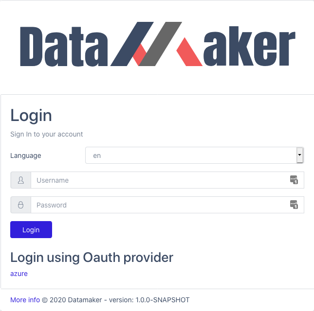
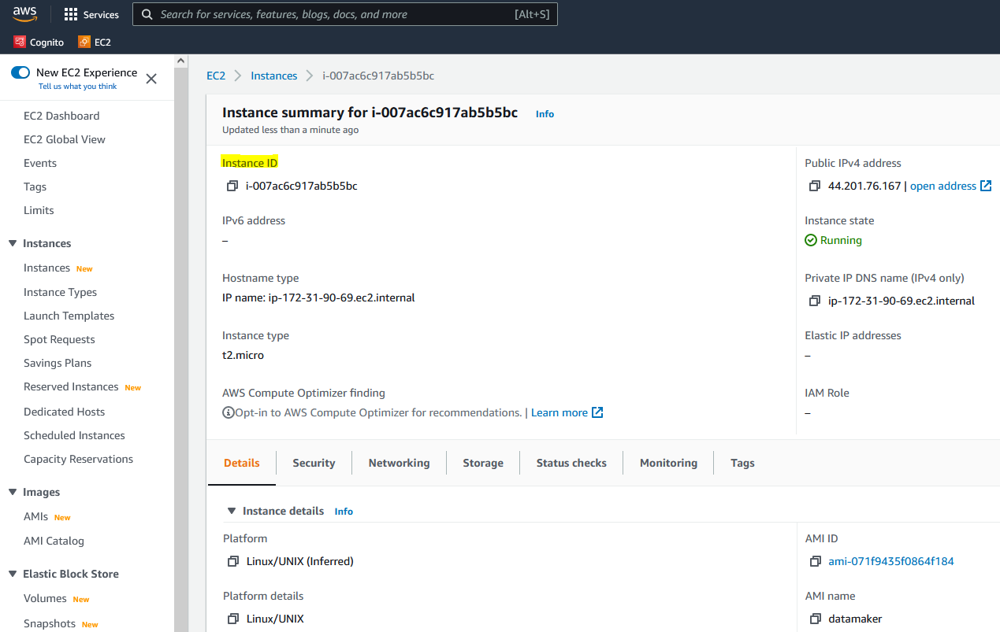
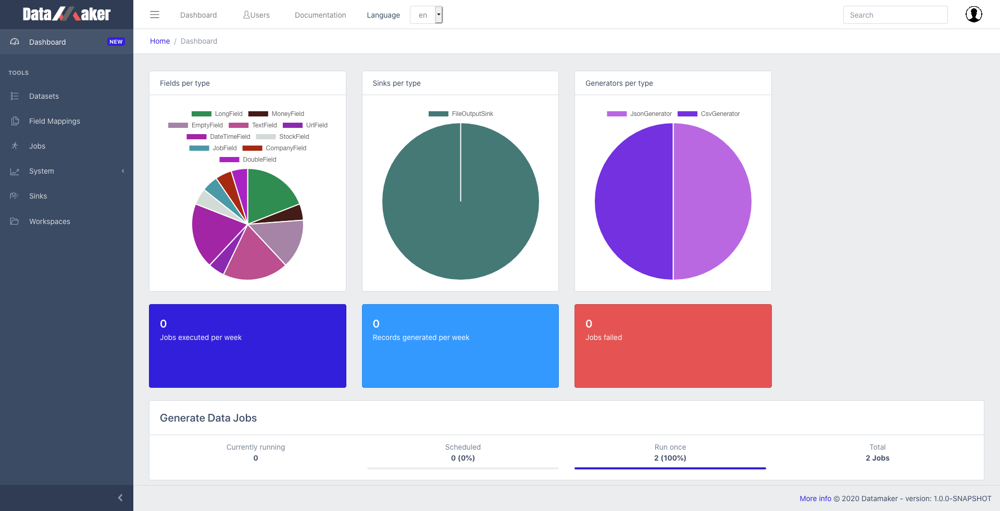

# Getting started Amazon AMI

## Login

**Initial credentials**

    Username: admin
    Password: [AMI Instance ID]

You can find out the AMI instance ID from the EC2 Console.

If you have configured Amazon Cognito, you can click on the oauth provider to login.

## Dashboard

### Header 
- Burger menu: show/hide left sidebar
- Dashboard: shows the home page
- Click on the Documentation link to read the docs
- Language: change the interface language
- Search is activated by entering a search keyword (wildcard * is supported)
- Click on the profile logo (top right corner) to log out or edit your profile

### Left Sidebar
You collapse or show the sidebar by clicking the arrow icon at the bottom left of the screen.
You can hide the sidebar entirely by clicking on the burger menu (3 lines).
The sidebar contains the following sections:
- Dashboard: home page with various statistics
- Datasets: dataset creation view
- Field mappings: global field mappings configuration
- Jobs: data generation jobs
- System:
  - Health: show performance metrics
  - Info: build info 
  - File manager: manage file resources
  - Logs: show application logs
- Sinks: manage global sink configuration
- Workspaces: workspace management view

### Main section

Displays the results, forms, metrics based on the section selected

## First steps

1. Create a workspace that will contain your datasets and jobs
2. Then create a dataset manually using the UI or you can also upload a sample file to infer data types
3. Using your dataset as input, create a data generation job
   1. You will configure the output format and also the target systems where the data will be sent (sinks)
4. Last step is to verify everything is working fine from the jobs main page
   1. Select history to see the execution output