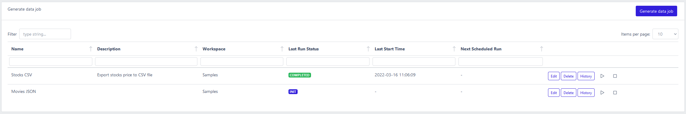
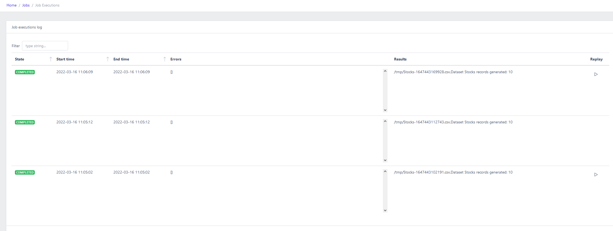
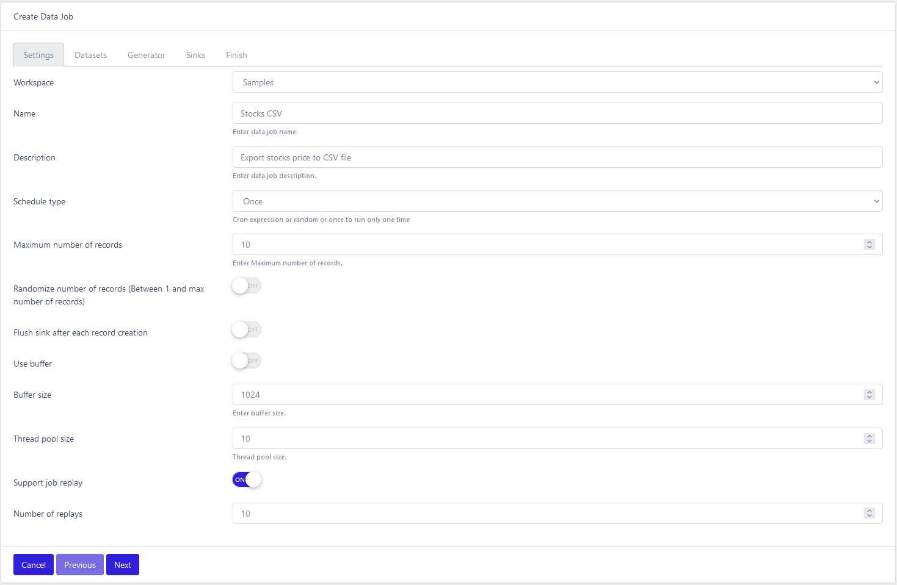
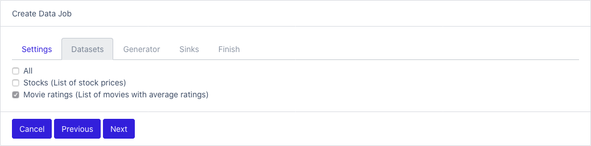
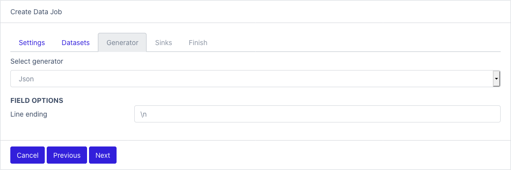
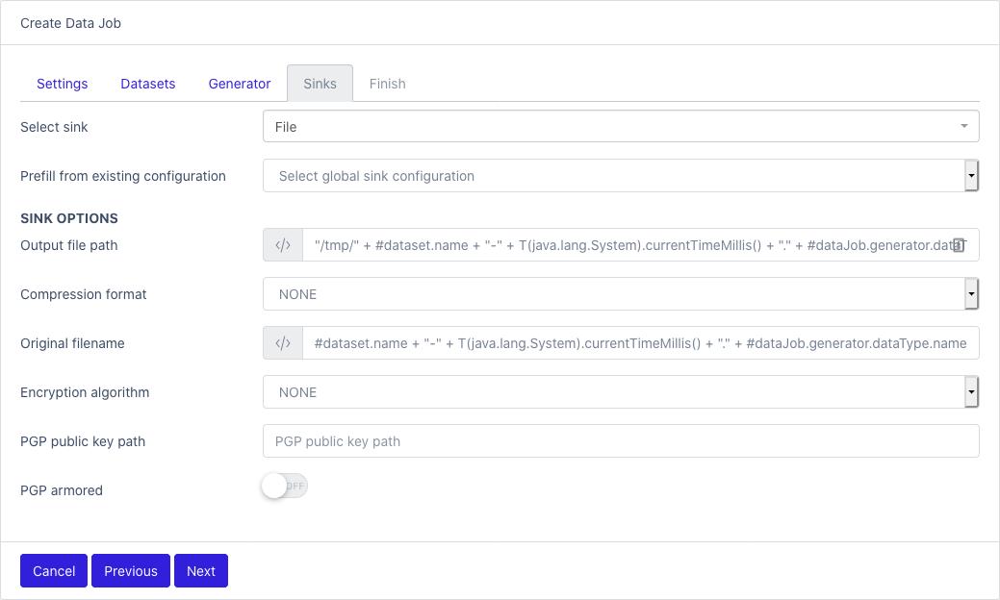
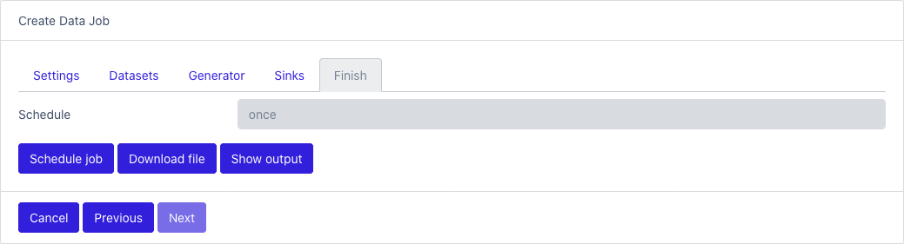

# Generate data jobs
{: .no_toc }

## Table of contents
{: .no_toc .text-delta }

1. TOC
{:toc}

### To view a list of all jobs: [Jobs](/dataset/jobs)

- Name
- Description
- Workspace
- Last Run Status: possible values
  - COMPLETED: finish successfully
  - RUNNING: job is started
  - CANCELLED: job was stopped during runtime
  - INIT: job is not started yet
  - FAILED: job run and halted with errors

### To view a list of job executions

Click on the History button

- State: see [DataJobs](jobs#to-view-a-list-of-all-jobs-jobs) 
- Start time
- End time
- Errors: contains error messages and exceptions if the job failed
- Results: contains helpful messages
- Replay: if the job is replayable, you can replay the job with the saved results as output.

## Create data generation job

There are 4 sections to configure a data generation job.
Complete each section, so you can schedule or run the job.

### Settings

- Workspace: select one
- Name
- Description
- Schedule type:
  - Once: run one time only
  - Cron: quartz cron string (http://www.quartz-scheduler.org/documentation/quartz-2.3.0/tutorials/crontrigger.html). 6 digits format: 0 * * * * *
  - Random: start the job in a random window. Configure the minimum and maximum delays.
- Maximum number of records: max records
- Randomize number of records
- Flush sink after each record creation: determine if the record is push to the sink after each creation
- Use buffer: control if records are stored in temporary memory before being pushed to the sink. Can optimize processing time if sink is slow. Act as a back pressure control.
- Buffer size: use in conjunction with Use buffer setting
- Thread pool size: controls how many thread are spawn to generate records
- Support job replay: flag that determine if job results will be persisted locally for future uses. That way you can replay the same records over and over in time.
- Number of replay: how many job replays are kept. Old ones are erased automatically.

### Datasets

- Check which datasets will be part of the job

### Generator

- Select one generator from the list
- Field options: each generator as its own specific configuration, see [Generators](generators)

### Sinks

- Select one sink from the list
- Prefill from existing configuration: if a [Global sink](sinks#global-sink-configurations) was configured, you can use it here.
- Sink options: each sink as its own specific configuration, see [Sinks](sinks#supported-sinks)

### Last step

- Schedule job: save and run the job based on the schedule
- Download file: run the job immediately and download the results
- Show output: run the job immediately and show the results in the console

