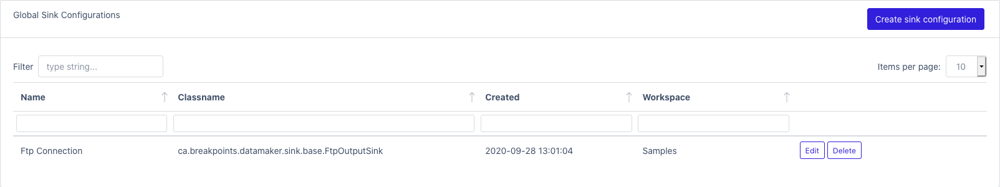
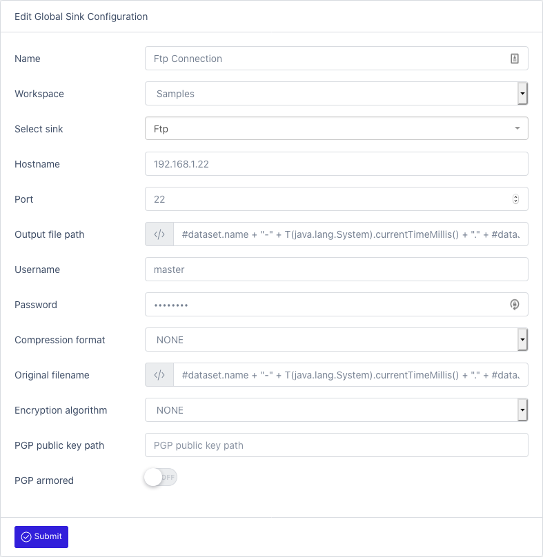

# Sinks
{: .no_toc }

## Table of contents
{: .no_toc .text-delta }

1. TOC
{:toc}

# Global Sink Configurations

### To view a list of all sinks: [Sinks](/datamaker/sinks)

### To create a new sink configuration: [Edit Sink](/datamaker/sinks)

- Name
- Worskspace
- Select sink: [Select from the supported list](sinks#supported-sinks)
- Configure additional parameters for the sink

# Supported Sinks

## AMAZON

### Amazon Glacier

Description:

Class: ca.breakpoints.datamaker.sink.amazon.AmazonGlacierVaultOutputSink

Configuration:

- AWS Credentials access key id
  - Type: STRING
  - Default value:
  - Possible values:
- AWS Credentials secret access key
  - Type: PASSWORD
  - Default value:
  - Possible values:
- AWS Region
  - Type: STRING
  - Default value: us-east-1
  - Possible values: ap-south-1, eu-south-1, us-gov-east-1, ca-central-1, eu-central-1, us-west-1, us-west-2, af-south-1, eu-north-1, eu-west-3, eu-west-2, eu-west-1, ap-northeast-3, ap-northeast-2, ap-northeast-1, me-south-1, sa-east-1, ap-east-1, cn-north-1, us-gov-west-1, ap-southeast-1, ap-southeast-2, us-iso-east-1, us-east-1, us-east-2, cn-northwest-1, us-isob-east-1, aws-global, aws-cn-global, aws-us-gov-global, aws-iso-global, aws-iso-b-global

### Amazon Kinesis

Description:

Class: ca.breakpoints.datamaker.sink.amazon.AmazonKinesisOutputSink

Configuration:

- Stream name (ARN)
  - Type: STRING
  - Default value:
  - Possible values:
- Partition key
  - Type: EXPRESSION
  - Default value: #dataset.name
  - Possible values:
- AWS Credentials access key id
  - Type: STRING
  - Default value:
  - Possible values:
- AWS Credentials secret access key
  - Type: PASSWORD
  - Default value:
  - Possible values:
- AWS Region
  - Type: STRING
  - Default value: us-east-1
  - Possible values: ap-south-1, eu-south-1, us-gov-east-1, ca-central-1, eu-central-1, us-west-1, us-west-2, af-south-1, eu-north-1, eu-west-3, eu-west-2, eu-west-1, ap-northeast-3, ap-northeast-2, ap-northeast-1, me-south-1, sa-east-1, ap-east-1, cn-north-1, us-gov-west-1, ap-southeast-1, ap-southeast-2, us-iso-east-1, us-east-1, us-east-2, cn-northwest-1, us-isob-east-1, aws-global, aws-cn-global, aws-us-gov-global, aws-iso-global, aws-iso-b-global

### Amazon S3

Description:

Class: ca.breakpoints.datamaker.sink.amazon.AmazonS3OutputSink

Configuration:

- S3 Bucket name
  - Type: STRING
  - Default value:
  - Possible values:
- S3 Bucket creation
  - Type: BOOLEAN
  - Default value: False
  - Possible values:
- S3 Object key
  - Type: EXPRESSION
  - Default value: #dataset.name + "-" + T(java.lang.System).currentTimeMillis() + "." + #dataJob.generator.dataType.name().toLowerCase()
  - Possible values:
- AWS Credentials access key id
  - Type: STRING
  - Default value:
  - Possible values:
- AWS Credentials secret access key
  - Type: PASSWORD
  - Default value:
  - Possible values:
- AWS Region
  - Type: STRING
  - Default value: us-east-1
  - Possible values: ap-south-1, eu-south-1, us-gov-east-1, ca-central-1, eu-central-1, us-west-1, us-west-2, af-south-1, eu-north-1, eu-west-3, eu-west-2, eu-west-1, ap-northeast-3, ap-northeast-2, ap-northeast-1, me-south-1, sa-east-1, ap-east-1, cn-north-1, us-gov-west-1, ap-southeast-1, ap-southeast-2, us-iso-east-1, us-east-1, us-east-2, cn-northwest-1, us-isob-east-1, aws-global, aws-cn-global, aws-us-gov-global, aws-iso-global, aws-iso-b-global
- Compression format
  - Type: STRING
  - Default value: NONE
  - Possible values: BZIP2, DEFLATE, GZIP, JAR, NONE, SNAPPY, TAR, TAR_BZIP2, TAR_GZIP, TGZ, ZIP
- Original filename
  - Type: EXPRESSION
  - Default value: #dataset.name + "-" + T(java.lang.System).currentTimeMillis() + "." + #dataJob.generator.dataType.name().toLowerCase()
  - Possible values:
- Encryption algorithm
  - Type: STRING
  - Default value: NONE
  - Possible values: BCRYPT, NONE, PGP
- PGP public key path
  - Type: STRING
  - Default value:
  - Possible values:
- PGP armored
  - Type: BOOLEAN
  - Default value: False
  - Possible values:

## AZURE

### Azure Blob Storage

Description:

Class: ca.breakpoints.datamaker.sink.azure.AzureBlobStorageOutputSink

Configuration:

- Container name
  - Type: STRING
  - Default value:
  - Possible values:
- Blob name
  - Type: EXPRESSION
  - Default value:
  - Possible values:
- Blob type
  - Type: STRING
  - Default value: BLOCK
  - Possible values: BLOCK, APPEND, PAGE, SNAPSHOT
- Page range start
  - Type: NUMERIC
  - Default value: 0
  - Possible values:
- Page range end
  - Type: NUMERIC
  - Default value: 0
  - Possible values:
- Snapshot ID
  - Type: EXPRESSION
  - Default value:
  - Possible values:
- Storage SAS TOKEN
  - Type: PASSWORD
  - Default value:
  - Possible values:
- Storage account name
  - Type: STRING
  - Default value:
  - Possible values:
- Username
  - Type: STRING
  - Default value:
  - Possible values:
- Password
  - Type: PASSWORD
  - Default value:
  - Possible values:
- Storage account key
  - Type: PASSWORD
  - Default value:
  - Possible values:
- Compression format
  - Type: STRING
  - Default value: NONE
  - Possible values: BZIP2, DEFLATE, GZIP, JAR, NONE, SNAPPY, TAR, TAR_BZIP2, TAR_GZIP, TGZ, ZIP
- Original filename
  - Type: EXPRESSION
  - Default value: #dataset.name + "-" + T(java.lang.System).currentTimeMillis() + "." + #dataJob.generator.dataType.name().toLowerCase()
  - Possible values:
- Encryption algorithm
  - Type: STRING
  - Default value: NONE
  - Possible values: BCRYPT, NONE, PGP
- PGP public key path
  - Type: STRING
  - Default value:
  - Possible values:
- PGP armored
  - Type: BOOLEAN
  - Default value: False
  - Possible values:

### Azure Datalake

Description:

Class: ca.breakpoints.datamaker.sink.azure.AzureDatalakeOutputSink

Configuration:

- Filesystem name
  - Type: STRING
  - Default value:
  - Possible values:
- File name
  - Type: EXPRESSION
  - Default value:
  - Possible values:
- Storage buffer
  - Type: NUMERIC
  - Default value: 1048576
  - Possible values:
- Storage SAS TOKEN
  - Type: PASSWORD
  - Default value:
  - Possible values:
- Storage account name
  - Type: STRING
  - Default value:
  - Possible values:
- Username
  - Type: STRING
  - Default value:
  - Possible values:
- Password
  - Type: PASSWORD
  - Default value:
  - Possible values:
- Storage account key
  - Type: PASSWORD
  - Default value:
  - Possible values:
- Compression format
  - Type: STRING
  - Default value: NONE
  - Possible values: BZIP2, DEFLATE, GZIP, JAR, NONE, SNAPPY, TAR, TAR_BZIP2, TAR_GZIP, TGZ, ZIP
- Original filename
  - Type: EXPRESSION
  - Default value: #dataset.name + "-" + T(java.lang.System).currentTimeMillis() + "." + #dataJob.generator.dataType.name().toLowerCase()
  - Possible values:
- Encryption algorithm
  - Type: STRING
  - Default value: NONE
  - Possible values: BCRYPT, NONE, PGP
- PGP public key path
  - Type: STRING
  - Default value:
  - Possible values:
- PGP armored
  - Type: BOOLEAN
  - Default value: False
  - Possible values:

### Azure Event Hub

Description:

Class: ca.breakpoints.datamaker.sink.azure.AzureEventHubOutputSink

Configuration:

- Connection string
  - Type: PASSWORD
  - Default value:
  - Possible values:
- Batch size (bytes)
  - Type: NUMERIC
  - Default value: 1024
  - Possible values:
- Batch duration (seconds)
  - Type: NUMERIC
  - Default value: 1
  - Possible values:

### Azure Storage Queue

Description:

Class: ca.breakpoints.datamaker.sink.azure.AzureStorageQueueOutputSink

Configuration:

## BASE

### Cifs

Description:

Class: ca.breakpoints.datamaker.sink.base.CifsOutputSink

Configuration:

- Hostname
  - Type: STRING
  - Default value: remote
  - Possible values:
- Port
  - Type: NUMERIC
  - Default value: 139
  - Possible values:
- Output file path
  - Type: EXPRESSION
  - Default value: "/" + #dataset.name + "-" + T(java.lang.System).currentTimeMillis() + "." + #dataJob.generator.dataType.name().toLowerCase()
  - Possible values:
- Username
  - Type: STRING
  - Default value:
  - Possible values:
- Password
  - Type: PASSWORD
  - Default value:
  - Possible values:
- Compression format
  - Type: STRING
  - Default value: NONE
  - Possible values: BZIP2, DEFLATE, GZIP, JAR, NONE, SNAPPY, TAR, TAR_BZIP2, TAR_GZIP, TGZ, ZIP
- Original filename
  - Type: EXPRESSION
  - Default value: #dataset.name + "-" + T(java.lang.System).currentTimeMillis() + "." + #dataJob.generator.dataType.name().toLowerCase()
  - Possible values:
- Encryption algorithm
  - Type: STRING
  - Default value: NONE
  - Possible values: BCRYPT, NONE, PGP
- PGP public key path
  - Type: STRING
  - Default value:
  - Possible values:
- PGP armored
  - Type: BOOLEAN
  - Default value: False
  - Possible values:

### Copy

Description:

Class: ca.breakpoints.datamaker.sink.base.CopyOutputSink

Configuration:

### Email

Description:

Class: ca.breakpoints.datamaker.sink.base.EmailOutputSink

Configuration:

- Data output format
  - Type: STRING
  - Default value: PLAIN_TEXT
  - Possible values: ATTACHMENT, PLAIN_TEXT, HTML
- Sender address (From)
  - Type: STRING
  - Default value:
  - Possible values:
- Recipient address (To)
  - Type: STRING
  - Default value:
  - Possible values:
- SMTP host
  - Type: STRING
  - Default value: localhost
  - Possible values:
- SMTP port
  - Type: NUMERIC
  - Default value: 25
  - Possible values:
- Subject line
  - Type: STRING
  - Default value:
  - Possible values:
- Message part in case of attachment
  - Type: STRING
  - Default value:
  - Possible values:
- File attachment name
  - Type: EXPRESSION
  - Default value: #dataset.name + "-" + T(java.lang.System).currentTimeMillis() + "." + #dataJob.generator.dataType.name().toLowerCase()
  - Possible values:
- Secured authentication
  - Type: STRING
  - Default value:
  - Possible values: , SSL, TLS
- Username
  - Type: STRING
  - Default value:
  - Possible values:
- Password
  - Type: PASSWORD
  - Default value:
  - Possible values:
- Compression format
  - Type: STRING
  - Default value: NONE
  - Possible values: BZIP2, DEFLATE, GZIP, JAR, NONE, SNAPPY, TAR, TAR_BZIP2, TAR_GZIP, TGZ, ZIP
- Original filename
  - Type: EXPRESSION
  - Default value: #dataset.name + "-" + T(java.lang.System).currentTimeMillis() + "." + #dataJob.generator.dataType.name().toLowerCase()
  - Possible values:
- Encryption algorithm
  - Type: STRING
  - Default value: NONE
  - Possible values: BCRYPT, NONE, PGP
- PGP public key path
  - Type: STRING
  - Default value:
  - Possible values:
- PGP armored
  - Type: BOOLEAN
  - Default value: False
  - Possible values:

### File

Description:

Class: ca.breakpoints.datamaker.sink.base.FileOutputSink

Configuration:

- Output file path
  - Type: EXPRESSION
  - Default value: "/tmp/" + #dataset.name + "-" + T(java.lang.System).currentTimeMillis() + "." + #dataJob.generator.dataType.name().toLowerCase()
  - Possible values:
- Compression format
  - Type: STRING
  - Default value: NONE
  - Possible values: BZIP2, DEFLATE, GZIP, JAR, NONE, SNAPPY, TAR, TAR_BZIP2, TAR_GZIP, TGZ, ZIP
- Original filename
  - Type: EXPRESSION
  - Default value: #dataset.name + "-" + T(java.lang.System).currentTimeMillis() + "." + #dataJob.generator.dataType.name().toLowerCase()
  - Possible values:
- Encryption algorithm
  - Type: STRING
  - Default value: NONE
  - Possible values: BCRYPT, NONE, PGP
- PGP public key path
  - Type: STRING
  - Default value:
  - Possible values:
- PGP armored
  - Type: BOOLEAN
  - Default value: False
  - Possible values:

### Ftp

Description:

Class: ca.breakpoints.datamaker.sink.base.FtpOutputSink

Configuration:

- Hostname
  - Type: STRING
  - Default value: remote
  - Possible values:
- Port
  - Type: NUMERIC
  - Default value: 22
  - Possible values:
- Output file path
  - Type: EXPRESSION
  - Default value: #dataset.name + "-" + T(java.lang.System).currentTimeMillis() + "." + #dataJob.generator.dataType.name().toLowerCase()
  - Possible values:
- Username
  - Type: STRING
  - Default value:
  - Possible values:
- Password
  - Type: PASSWORD
  - Default value:
  - Possible values:
- Compression format
  - Type: STRING
  - Default value: NONE
  - Possible values: BZIP2, DEFLATE, GZIP, JAR, NONE, SNAPPY, TAR, TAR_BZIP2, TAR_GZIP, TGZ, ZIP
- Original filename
  - Type: EXPRESSION
  - Default value: #dataset.name + "-" + T(java.lang.System).currentTimeMillis() + "." + #dataJob.generator.dataType.name().toLowerCase()
  - Possible values:
- Encryption algorithm
  - Type: STRING
  - Default value: NONE
  - Possible values: BCRYPT, NONE, PGP
- PGP public key path
  - Type: STRING
  - Default value:
  - Possible values:
- PGP armored
  - Type: BOOLEAN
  - Default value: False
  - Possible values:

### Http

Description:

Class: ca.breakpoints.datamaker.sink.base.HttpOutputSink

Configuration:

- Endpoint URL
  - Type: STRING
  - Default value:
  - Possible values:
- Method
  - Type: STRING
  - Default value: POST
  - Possible values: PATCH, PUT, POST
- Payload
  - Type: STRING
  - Default value: BODY
  - Possible values: BODY, MULTIPART
- Content type
  - Type: EXPRESSION
  - Default value:
  - Possible values:
- Authentication method
  - Type: STRING
  - Default value: NONE
  - Possible values: BASIC, KERBEROS, NONE, SPNEGO
- Http query names
  - Type: LIST
  - Default value: []
  - Possible values:
- Http query values (support expression)
  - Type: LIST
  - Default value: []
  - Possible values:
- Http header names
  - Type: LIST
  - Default value: []
  - Possible values:
- Http header values (support expression)
  - Type: LIST
  - Default value: []
  - Possible values:
- Form parameter names
  - Type: LIST
  - Default value: []
  - Possible values:
- Form parameter values (support expression)
  - Type: LIST
  - Default value: []
  - Possible values:
- Form parameter types (binary or text)
  - Type: LIST
  - Default value: []
  - Possible values:
- Username
  - Type: STRING
  - Default value: elastic
  - Possible values:
- Password
  - Type: PASSWORD
  - Default value:
  - Possible values:
- Kerberos principal
  - Type: STRING
  - Default value:
  - Possible values:
- Kerberos keytab
  - Type: STRING
  - Default value:
  - Possible values:
- Truststore filename
  - Type: STRING
  - Default value:
  - Possible values:
- Truststore password
  - Type: PASSWORD
  - Default value: changeit
  - Possible values:
- Keystore filename
  - Type: STRING
  - Default value:
  - Possible values:
- Keystore password
  - Type: PASSWORD
  - Default value: changeit
  - Possible values:

### Jdbc

Description:

Class: ca.breakpoints.datamaker.sink.base.JdbcOutputSink

Configuration:

- JDBC driver class name
  - Type: STRING
  - Default value:
  - Possible values:
- Connection URL
  - Type: STRING
  - Default value:
  - Possible values:
- Username
  - Type: STRING
  - Default value:
  - Possible values:
- Password
  - Type: PASSWORD
  - Default value:
  - Possible values:

### Jms

Description:

Class: ca.breakpoints.datamaker.sink.base.JmsOutputSink

Configuration:

- A fully qualified name of the JMS ConnectionFactory implementation class (i.e., org.apache.activemq.ActiveMQConnectionFactory)
  - Type: STRING
  - Default value:
  - Possible values:
- Topic name
  - Type: STRING
  - Default value:
  - Possible values:
- Destination name (ex: topicName, queueName)
  - Type: STRING
  - Default value:
  - Possible values:
- Destination type
  - Type: STRING
  - Default value: TOPIC
  - Possible values: QUEUE, TOPIC
- Message ID
  - Type: EXPRESSION
  - Default value:
  - Possible values:
- Username
  - Type: STRING
  - Default value:
  - Possible values:
- Password
  - Type: PASSWORD
  - Default value:
  - Possible values:
- Truststore filename
  - Type: STRING
  - Default value:
  - Possible values:
- Truststore password
  - Type: PASSWORD
  - Default value: changeit
  - Possible values:
- Keystore filename
  - Type: STRING
  - Default value:
  - Possible values:
- Keystore password
  - Type: PASSWORD
  - Default value: changeit
  - Possible values:

### Log

Description:

Class: ca.breakpoints.datamaker.sink.base.LogOutputSink

Configuration:

- Prefix
  - Type: STRING
  - Default value: DATA:
  - Possible values:

### Proxy

Description:

Class: ca.breakpoints.datamaker.sink.base.ProxyOutputSink

Configuration:

### Sftp

Description:

Class: ca.breakpoints.datamaker.sink.base.SftpOutputSink

Configuration:

- Hostname
  - Type: STRING
  - Default value: remote
  - Possible values:
- Port
  - Type: NUMERIC
  - Default value: 139
  - Possible values:
- Output file path
  - Type: EXPRESSION
  - Default value: #dataset.name + "-" + T(java.lang.System).currentTimeMillis() + "." + #dataJob.generator.dataType.name().toLowerCase()
  - Possible values:
- Username
  - Type: STRING
  - Default value:
  - Possible values:
- Password
  - Type: PASSWORD
  - Default value:
  - Possible values:
- Use User's home as path root
  - Type: BOOLEAN
  - Default value:
  - Possible values:
- Private key path
  - Type: STRING
  - Default value:
  - Possible values:
- Passphrase
  - Type: PASSWORD
  - Default value:
  - Possible values:
- Compression format
  - Type: STRING
  - Default value: NONE
  - Possible values: BZIP2, DEFLATE, GZIP, JAR, NONE, SNAPPY, TAR, TAR_BZIP2, TAR_GZIP, TGZ, ZIP
- Original filename
  - Type: EXPRESSION
  - Default value: #dataset.name + "-" + T(java.lang.System).currentTimeMillis() + "." + #dataJob.generator.dataType.name().toLowerCase()
  - Possible values:
- Encryption algorithm
  - Type: STRING
  - Default value: NONE
  - Possible values: BCRYPT, NONE, PGP
- PGP public key path
  - Type: STRING
  - Default value:
  - Possible values:
- PGP armored
  - Type: BOOLEAN
  - Default value: False
  - Possible values:

### Socket

Description:

Class: ca.breakpoints.datamaker.sink.base.SocketOutputSink

Configuration:

- Port number
  - Type: NUMERIC
  - Default value: 0
  - Possible values: 0, 65535
- Hostname
  - Type: STRING
  - Default value: localhost
  - Possible values:
- Socket protocol
  - Type: STRING
  - Default value: TCP
  - Possible values: TCP, UDP
- Header message
  - Type: STRING
  - Default value:
  - Possible values:
- Footer message
  - Type: STRING
  - Default value:
  - Possible values:

### String

Description:

Class: ca.breakpoints.datamaker.sink.base.StringOutputSink

Configuration:

### Web Dav

Description:

Class: ca.breakpoints.datamaker.sink.base.WebDavOutputSink

Configuration:

- Hostname
  - Type: STRING
  - Default value: remote
  - Possible values:
- Port
  - Type: NUMERIC
  - Default value: 80
  - Possible values:
- Output file path
  - Type: EXPRESSION
  - Default value: "/" + #dataset.name + "-" + T(java.lang.System).currentTimeMillis() + "." + #dataJob.generator.dataType.name().toLowerCase()
  - Possible values:
- Username
  - Type: STRING
  - Default value:
  - Possible values:
- Password
  - Type: PASSWORD
  - Default value:
  - Possible values:
- Compression format
  - Type: STRING
  - Default value: NONE
  - Possible values: BZIP2, DEFLATE, GZIP, JAR, NONE, SNAPPY, TAR, TAR_BZIP2, TAR_GZIP, TGZ, ZIP
- Original filename
  - Type: EXPRESSION
  - Default value: #dataset.name + "-" + T(java.lang.System).currentTimeMillis() + "." + #dataJob.generator.dataType.name().toLowerCase()
  - Possible values:
- Encryption algorithm
  - Type: STRING
  - Default value: NONE
  - Possible values: BCRYPT, NONE, PGP
- PGP public key path
  - Type: STRING
  - Default value:
  - Possible values:
- PGP armored
  - Type: BOOLEAN
  - Default value: False
  - Possible values:

## ELASTIC

### Elastic Search

Description:

Class: ca.breakpoints.datamaker.sink.elastic.ElasticSearchOutputSink

Configuration:

- Endpoints (scheme:host:port)
  - Type: LIST
  - Default value: ['http:localhost:9200']
  - Possible values:
- Index name
  - Type: STRING
  - Default value:
  - Possible values:
- Username
  - Type: STRING
  - Default value: elastic
  - Possible values:
- Password
  - Type: PASSWORD
  - Default value:
  - Possible values:
- Retry count
  - Type: NUMERIC
  - Default value: 5
  - Possible values:
- Truststore filename
  - Type: STRING
  - Default value:
  - Possible values:
- Truststore password
  - Type: PASSWORD
  - Default value: changeit
  - Possible values:
- Keystore filename
  - Type: STRING
  - Default value:
  - Possible values:
- Keystore password
  - Type: PASSWORD
  - Default value: changeit
  - Possible values:

## GOOGLE

### Google Cloud Storage

Description:

Class: ca.breakpoints.datamaker.sink.google.GoogleCloudStorageOutputSink

Configuration:

- Container name
  - Type: STRING
  - Default value:
  - Possible values:
- Object name
  - Type: EXPRESSION
  - Default value:
  - Possible values:
- Project ID
  - Type: STRING
  - Default value:
  - Possible values:
- Service account JSON key
  - Type: STRING
  - Default value: {}
  - Possible values:
- OAuth token value
  - Type: STRING
  - Default value:
  - Possible values:
- Authentication method
  - Type: STRING
  - Default value: SERVICE_ACCOUNT
  - Possible values: OAUTH_TOKEN, PLATFORM, SERVICE_ACCOUNT
- Compression format
  - Type: STRING
  - Default value: NONE
  - Possible values: BZIP2, DEFLATE, GZIP, JAR, NONE, SNAPPY, TAR, TAR_BZIP2, TAR_GZIP, TGZ, ZIP
- Original filename
  - Type: EXPRESSION
  - Default value: #dataset.name + "-" + T(java.lang.System).currentTimeMillis() + "." + #dataJob.generator.dataType.name().toLowerCase()
  - Possible values:
- Encryption algorithm
  - Type: STRING
  - Default value: NONE
  - Possible values: BCRYPT, NONE, PGP
- PGP public key path
  - Type: STRING
  - Default value:
  - Possible values:
- PGP armored
  - Type: BOOLEAN
  - Default value: False
  - Possible values:

### Google Pub Sub

Description:

Class: ca.breakpoints.datamaker.sink.google.GooglePubSubOutputSink

Configuration:

- Topic name
  - Type: STRING
  - Default value:
  - Possible values:
- Project ID
  - Type: STRING
  - Default value:
  - Possible values:
- Authentication method
  - Type: STRING
  - Default value: SERVICE_ACCOUNT
  - Possible values: OAUTH_TOKEN, PLATFORM, SERVICE_ACCOUNT
- Service account JSON key
  - Type: STRING
  - Default value: {}
  - Possible values:
- OAuth token value
  - Type: STRING
  - Default value:
  - Possible values:

## HADOOP

### Hdfs

Description:

Class: ca.breakpoints.datamaker.sink.hadoop.HdfsOutputSink

Configuration:

- A file or comma separated list of files which contains the Hadoop file system configuration. Without this, Hadoop will search the classpath for a 'core-site.xml' and 'hdfs-site.xml' file or will revert to a default configuration.
  - Type: STRING
  - Default value:
  - Possible values:
- Output file path
  - Type: EXPRESSION
  - Default value: '/tmp'
  - Possible values:
- Output file path
  - Type: EXPRESSION
  - Default value: #dataset.name + "-" + T(java.lang.System).currentTimeMillis() + "." + #dataJob.generator.dataType.name().toLowerCase()
  - Possible values:
- Kerberos principal
  - Type: STRING
  - Default value:
  - Possible values:
- Kerberos keytab
  - Type: STRING
  - Default value:
  - Possible values:
- Kerberized cluster
  - Type: BOOLEAN
  - Default value: False
  - Possible values:
- Name node
  - Type: STRING
  - Default value: OVERWRITE
  - Possible values: APPEND, FAILED, OVERWRITE
- Size of each block as written to HDFS
  - Type: NUMERIC
  - Default value: 33554432
  - Possible values:
- Amount of memory to use to buffer file contents during IO
  - Type: NUMERIC
  - Default value: 4096
  - Possible values:
- Number of times that HDFS will replicate each file
  - Type: NUMERIC
  - Default value: 1
  - Possible values:
- A umask represented as an octal number which determines the permissions of files written to HDFS
  - Type: NUMERIC
  - Default value: 18
  - Possible values:
- Changes the owner of the HDFS file to this value after it is written
  - Type: STRING
  - Default value:
  - Possible values:
- Changes the group of the HDFS file to this value after it is written
  - Type: STRING
  - Default value:
  - Possible values:
- Compression format
  - Type: STRING
  - Default value: NONE
  - Possible values: BZIP2, DEFLATE, GZIP, JAR, NONE, SNAPPY, TAR, TAR_BZIP2, TAR_GZIP, TGZ, ZIP
- Original filename
  - Type: EXPRESSION
  - Default value: #dataset.name + "-" + T(java.lang.System).currentTimeMillis() + "." + #dataJob.generator.dataType.name().toLowerCase()
  - Possible values:
- Encryption algorithm
  - Type: STRING
  - Default value: NONE
  - Possible values: BCRYPT, NONE, PGP
- PGP public key path
  - Type: STRING
  - Default value:
  - Possible values:
- PGP armored
  - Type: BOOLEAN
  - Default value: False
  - Possible values:

### Knox Ouput Sink

Description:

Class: ca.breakpoints.datamaker.sink.hadoop.KnoxOuputSink

Configuration:

- Knox Endpoint URL
  - Type: STRING
  - Default value:
  - Possible values:
- Output file path
  - Type: EXPRESSION
  - Default value: "/tmp"
  - Possible values:
- Append mode
  - Type: BOOLEAN
  - Default value: False
  - Possible values:
- Username
  - Type: STRING
  - Default value: elastic
  - Possible values:
- Password
  - Type: PASSWORD
  - Default value:
  - Possible values:
- Truststore filename
  - Type: STRING
  - Default value:
  - Possible values:
- Truststore password
  - Type: PASSWORD
  - Default value: changeit
  - Possible values:
- Keystore filename
  - Type: STRING
  - Default value:
  - Possible values:
- Keystore password
  - Type: PASSWORD
  - Default value: changeit
  - Possible values:
- Compression format
  - Type: STRING
  - Default value: NONE
  - Possible values: BZIP2, DEFLATE, GZIP, JAR, NONE, SNAPPY, TAR, TAR_BZIP2, TAR_GZIP, TGZ, ZIP
- Original filename
  - Type: EXPRESSION
  - Default value: #dataset.name + "-" + T(java.lang.System).currentTimeMillis() + "." + #dataJob.generator.dataType.name().toLowerCase()
  - Possible values:
- Encryption algorithm
  - Type: STRING
  - Default value: NONE
  - Possible values: BCRYPT, NONE, PGP
- PGP public key path
  - Type: STRING
  - Default value:
  - Possible values:
- PGP armored
  - Type: BOOLEAN
  - Default value: False
  - Possible values:

### Web Hdfs

Description:

Class: ca.breakpoints.datamaker.sink.hadoop.WebHdfsOutputSink

Configuration:

- Endpoint URL
  - Type: STRING
  - Default value:
  - Possible values:
- Output file path
  - Type: EXPRESSION
  - Default value: "/tmp"
  - Possible values:
- Append mode
  - Type: BOOLEAN
  - Default value: False
  - Possible values:
- Kerberized cluster
  - Type: BOOLEAN
  - Default value: False
  - Possible values:
- Kerberos principal
  - Type: STRING
  - Default value:
  - Possible values:
- Kerberos keytab
  - Type: STRING
  - Default value:
  - Possible values:
- Truststore filename
  - Type: STRING
  - Default value:
  - Possible values:
- Truststore password
  - Type: PASSWORD
  - Default value: changeit
  - Possible values:
- Keystore filename
  - Type: STRING
  - Default value:
  - Possible values:
- Keystore password
  - Type: PASSWORD
  - Default value: changeit
  - Possible values:
- Compression format
  - Type: STRING
  - Default value: NONE
  - Possible values: BZIP2, DEFLATE, GZIP, JAR, NONE, SNAPPY, TAR, TAR_BZIP2, TAR_GZIP, TGZ, ZIP
- Original filename
  - Type: EXPRESSION
  - Default value: #dataset.name + "-" + T(java.lang.System).currentTimeMillis() + "." + #dataJob.generator.dataType.name().toLowerCase()
  - Possible values:
- Encryption algorithm
  - Type: STRING
  - Default value: NONE
  - Possible values: BCRYPT, NONE, PGP
- PGP public key path
  - Type: STRING
  - Default value:
  - Possible values:
- PGP armored
  - Type: BOOLEAN
  - Default value: False
  - Possible values:

## IBM

### Ibm Cloud Object Storage

Description:

Class: ca.breakpoints.datamaker.sink.ibm.IbmCloudObjectStorageOutputSink

Configuration:

- S3 Bucket name
  - Type: STRING
  - Default value:
  - Possible values:
- S3 Bucket creation
  - Type: BOOLEAN
  - Default value: False
  - Possible values:
- S3 Object key
  - Type: EXPRESSION
  - Default value: #dataset.name + "-" + T(java.lang.System).currentTimeMillis() + "." + #dataJob.generator.dataType.name().toLowerCase()
  - Possible values:
- AWS Credentials access key id
  - Type: STRING
  - Default value:
  - Possible values:
- AWS Credentials secret access key
  - Type: PASSWORD
  - Default value:
  - Possible values:
- AWS Region
  - Type: STRING
  - Default value: us-east-1
  - Possible values: ap-south-1, eu-south-1, us-gov-east-1, ca-central-1, eu-central-1, us-west-1, us-west-2, af-south-1, eu-north-1, eu-west-3, eu-west-2, eu-west-1, ap-northeast-3, ap-northeast-2, ap-northeast-1, me-south-1, sa-east-1, ap-east-1, cn-north-1, us-gov-west-1, ap-southeast-1, ap-southeast-2, us-iso-east-1, us-east-1, us-east-2, cn-northwest-1, us-isob-east-1, aws-global, aws-cn-global, aws-us-gov-global, aws-iso-global, aws-iso-b-global

## KAFKA

### Kafka

Description:

Class: ca.breakpoints.datamaker.sink.kafka.KafkaOutputSink

Configuration:

- Kafka synchronous send
  - Type: BOOLEAN
  - Default value: False
  - Possible values:
- Kafka topic name
  - Type: STRING
  - Default value:
  - Possible values:
- Kafka bootstrap servers (<code>host1:port1,host2:port2,...</code>)
  - Type: STRING
  - Default value:
  - Possible values:
- Kafka client id
  - Type: STRING
  - Default value:
  - Possible values:
- Security protocols
  - Type: STRING
  - Default value: PLAINTEXT
  - Possible values: PLAINTEXT, SSL, SASL_PLAINTEXT, SASL_SSL
- Kerberos keytab
  - Type: STRING
  - Default value:
  - Possible values:
- Kerberos principal
  - Type: STRING
  - Default value:
  - Possible values:
- Kafka header names
  - Type: LIST
  - Default value: []
  - Possible values:
- Kafka header values (support expression)
  - Type: LIST
  - Default value: []
  - Possible values:
- Truststore filename
  - Type: STRING
  - Default value:
  - Possible values:
- Truststore password
  - Type: PASSWORD
  - Default value: changeit
  - Possible values:
- Keystore filename
  - Type: STRING
  - Default value:
  - Possible values:
- Keystore password
  - Type: PASSWORD
  - Default value: changeit
  - Possible values:

## SINK

### Object

Description:

Class: ca.breakpoints.datamaker.sink.ObjectOutputSink

Configuration:

## SOLR

### Solr

Description:

Class: ca.breakpoints.datamaker.sink.solr.SolrOutputSink

Configuration: 

