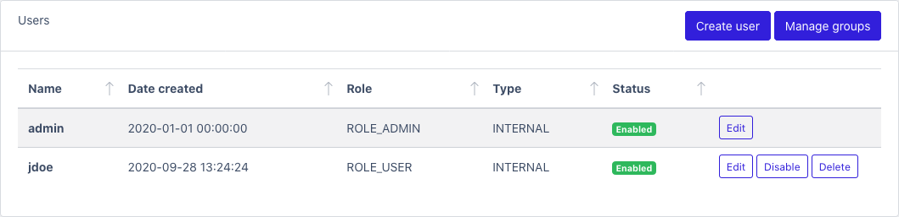
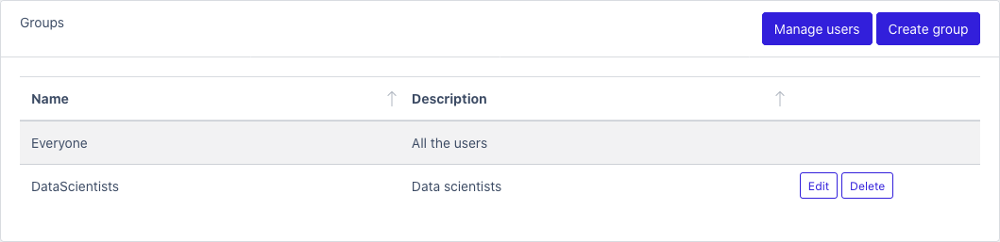
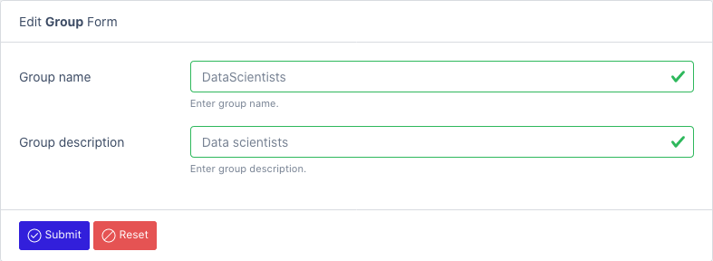
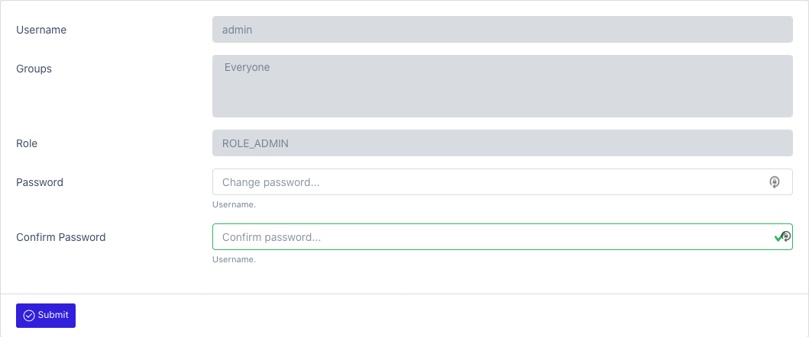

# Users

Use this page to create, list or manage the registered users.

### To view a list of all users: [Users](/datamaker/users)

### To create a new user: [Create User](/datamaker/users/create)

- First name
- Last name
- Username
- Password
  - **Policy**: Must contain at least one number and one uppercase and lowercase letter, and at least 8 or more characters
- Role: Specify the role
- Language: Set the user language
- Assign the groups

### To view all groups: [Manage Groups](/datamaker/users/groups)

### To create a group: [Create Group](/datamaker/users/groups/create)

## To edit your profile: [Profile](/datamaker/profile)

You can change your password by clicking of the account icon in the top right corner and select Profile.

