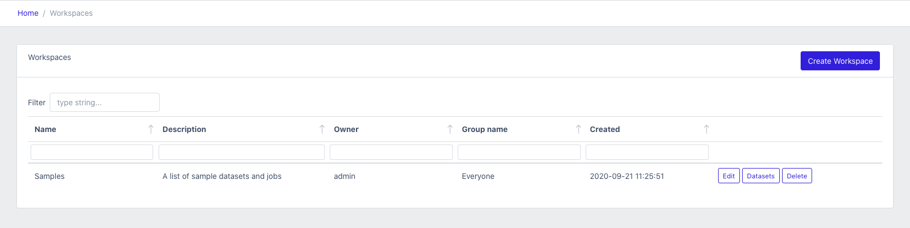
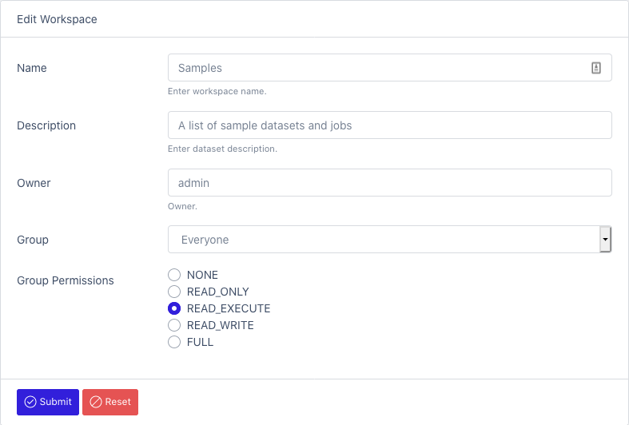

# Workspaces

The concept of a workspace is similar to a project.
A workspace contains all related components (datasets, fields, sinks).
It's a way to segment data jobs logically.

### To view a list of all workspaces: [Workspaces](/datamaker/workspaces)

From this view you can see who is the owner of the workspace and if any group is assigned to it.
You can also edit or delete the workspace from this view.

### To create a new workspace: [Create Workspace](/datamaker/workspaces/create)

Using this form you can create or edit workspace.
By default, only the user can modify the workspace and no group is defined.

- Name
- Description
- Owner: The default owner assigned is the current logged user. You can change it by specifying the username
- Group: assign a group to the workspace
- Group Permissions: 
  - NONE: disable access
  - READ_ONLY: browse only
  - READ_EXECUTE: browse and run jobs
  - READ_WRITE: create and modify items
  - FULL: admin privileges

If you are an admin, you can create new groups form the [Users section](/datamaker/users/groups) 

